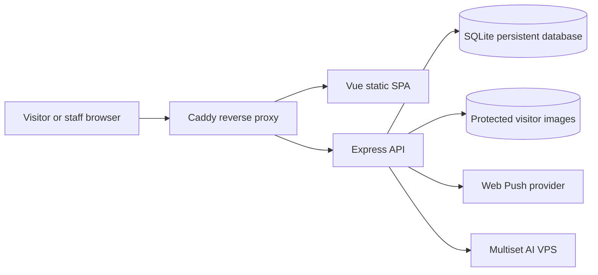

# BSU Visitor — Master System Blueprint

> Consolidated system direction, architecture, workflows, UI rules, security requirements, database concepts, API boundaries, responsive design, QA evidence, and renovation scope.
>
> **Status:** Approved design/architecture blueprint for the complete renovation.
> **Implementation status:** This document consolidates the plans and wiki information. It does not itself implement the renovation.
> **Repository:** `/home/kim-eduard-saludes/bsu_visitor`
> **Institution:** Batangas State University — NEU

---

## 1. Product identity

BSU Visitor is a **campus visitor and service-navigation platform**, not an internal staff dashboard with visitor features added.

The primary user is the public visitor. Protected operational areas exist for staff, security, and administrators.

The platform replaces manual visitor logbooks with a controlled digital workflow:

```text
Find an office
    ↓
View privacy-safe office availability and queue information
    ↓
Register as a visitor or receive security-assisted registration
    ↓
Receive an opaque access token and reference number
    ↓
Wait in one queue for the selected office
    ↓
Office staff processes the visit
    ↓
Visit is completed and a shared exit deadline begins
    ↓
Visitor leaves campus
    ↓
Security confirms physical sign-out
```

The system must remain understandable to visitors, practical for university employees, safe for security operations, and maintainable as a real platform.

---

## 2. Confirmed product decisions

1. Visitors do not create accounts.
2. Visitors use a server-issued opaque access token to check status.
3. The browser stores only the token; visitor data remains backend-authoritative.
4. There is one queue per office for the MVP.
5. Exit grace time is configurable globally and applies to all offices.
6. Web Push is the selected notification channel.
7. Visible in-app status and alarms remain mandatory fallbacks when push, audio, or permissions are unavailable.
8. Operational dashboards come before advanced analytics.
9. The existing AR destinations, map settings, and pathway behavior must be preserved.
10. AR is already physically verified by the user and must not be treated as a broken feature.
11. Text/map navigation is a compatibility fallback for unsupported devices.
12. Public pages must not expose visitor names, addresses, contact numbers, photos, or full visitor records.
13. Public QR pages are visitor registration entry points, not office-management dashboards.
14. Staff may manage only their assigned office.
15. Security may monitor campus-relevant visitor activity and perform physical sign-out.
16. Admin manages configuration, users, offices, audit data, and operational overview.

---

## 3. System architecture

### 3.1 Architectural layers

```text
Presentation layer
  Vue 3 SPA, public experience, role portals, responsive shells, AR navigation

Application layer
  Express API, authentication, authorization, lifecycle rules, queues,
  notifications, privacy projections, audit logging

Data layer
  SQLite via better-sqlite3, users, roles, offices, visitors, visit logs,
  token hashes, deadlines, subscriptions, notification events, audit records

Integration layer
  Web Push provider, Multiset AI VPS, WebXR/AR, reverse proxy, file storage
```

### 3.2 Technology stack

| Layer | Technology | Responsibility |
|---|---|---|
| Frontend | Vue 3 | User interface and route views |
| State | Pinia | Session, office, visitor, queue, notification state |
| Routing | Vue Router | Public and role-protected routes |
| Styling | Tailwind CSS v4 | Responsive design and design tokens |
| Build/dev | Vite | Frontend build and local proxy |
| Backend | Node.js + Express 5 | API and business logic |
| Authentication | JWT in httpOnly cookies | Protected staff/security/admin sessions |
| Authorization | Backend RBAC and office ownership middleware | Server-enforced permissions |
| Database | SQLite + better-sqlite3 | Persistent operational records |
| Uploads | Multer with signature/authorization checks | Security visitor photos |
| AR | Multiset AI VPS, Three.js, WebXR | Existing campus navigation |
| Deployment | Docker Compose + Caddy | Production services and one-origin routing |
| Notifications | Web Push abstraction/provider | Office/security operational notifications |

### 3.3 Deployment topology



Production services:

- `frontend`: built Vue application
- `backend`: Express API, migrations, SQLite access
- `proxy`: Caddy HTTPS/reverse proxy and SPA fallback
- persistent database volume
- protected uploads volume

The browser should normally use one public origin. The reverse proxy routes `/api/*` to the backend and serves the SPA for frontend routes.

---

## 4. Platform modules

The platform is organized into explicit modules rather than one page:

1. Public visitor services
2. Campus directory and office availability
3. Visitor registration
4. Token-based visitor status
5. Queue management
6. Office operations
7. Security kiosk and campus monitoring
8. Sign-out and overdue handling
9. Notifications and alarms
10. Operational dashboards
11. Campus navigation and AR
12. Administration and configuration
13. Audit logging
14. Privacy, reliability, and support

Each module should have:

- clear frontend views/components
- dedicated stores/composables where useful
- backend routes/controllers/models
- role and privacy rules
- loading, empty, error, and offline states
- focused tests and documented acceptance behavior

---

## 5. User experience architecture

### 5.1 Public shell

Public pages use a visitor-focused `PublicShell`.

The public experience must not show protected staff navigation. It should provide a simple mobile-friendly header with:

- BSU Visitor identity
- Home
- Find an Office
- Register
- Check Status
- AR Navigation
- optional compact menu on small screens
- secondary Staff Sign in action

Public routes:

- `/`
- `/directory`
- `/register`
- `/status`
- `/office`
- `/office/:id`
- `/navigate`

The visitor homepage should prioritize:

1. Find an Office
2. Register as Visitor
3. Check Visitor Status
4. AR Navigation

Login is secondary and must not dominate the public experience.

### 5.2 Protected application shell

Authenticated staff, security, and admin pages use one responsive `AppShell` with a **sidebar**, not a top navigation bar.

Desktop:

```text
┌───────────────┬────────────────────────────────────────────┐
│ BSU Visitor   │ Page title                    Account      │
│ role context  ├────────────────────────────────────────────┤
│               │                                            │
│ Dashboard     │ Main page content                          │
│ Visitors      │ Cards, tables, queue, forms, alerts        │
│ Offices       │                                            │
│ Notifications │                                            │
│ Reports       │                                            │
│ Settings      │                                            │
│               │                                            │
│ User profile  │                                            │
│ Sign out      │                                            │
└───────────────┴────────────────────────────────────────────┘
```

Sidebar rules:

- role-aware links only
- active route state
- clear icon plus text labels
- collapsible desktop sidebar if useful
- account context and role label
- sign-out always reachable
- keyboard focus and Escape support
- no QR management link for staff/security
- admin QR management visible only to admin

Mobile:

- sidebar becomes a hidden drawer
- hamburger/menu button opens the drawer
- backdrop closes the drawer
- Escape closes the drawer
- route selection closes the drawer
- main content uses full width
- no horizontal overflow
- tables become cards or horizontally scrollable regions
- touch targets are at least comfortable for phone use
- critical actions remain visible without excessive scrolling

The existing UI architecture work already introduced `PublicShell` and responsive `AppShell`; the renovation must preserve the separation and finish consistency, route cleanup, and mobile QA.

### 5.3 Role navigation

#### Staff sidebar

- Staff Dashboard
- My Office Queue
- Visit History
- Office Availability
- Notifications
- Account

Staff must not see:

- unrelated offices
- admin users/settings
- security kiosk operations
- campus-wide sensitive visitor lists
- admin QR management

#### Security sidebar

- Security Dashboard
- Register Walk-in Visitor
- Active Visitors
- Pending Sign-outs
- Overdue Visitors
- Office Availability
- Notifications
- Account

Security can access detailed operational records required for campus safety.

#### Admin sidebar

- Admin Dashboard
- Office Directory
- QR Management
- Users and Roles
- Visitor/Visit Records
- Notifications
- Audit Logs
- System Settings
- Account

Admin configuration includes the global exit grace period, dashboard permissions, notification policy, and operational settings.

---

## 6. Public visitor experience

### 6.1 Find an Office

The directory displays:

- office name
- short description/service label
- location/building information when approved
- availability: Available, Busy, Not available
- one queue count
- estimated wait
- anonymous occupancy indicator
- Register action
- Navigate action

Never display:

- visitor names
- visitor contact details
- addresses
- visitor photos
- raw database records
- internal user information

Empty state:

```text
No offices are currently available.
Please try again later or ask security for assistance.
```

### 6.2 Registration

The registration form accepts the minimum required information:

- destination office
- full name
- contact number
- address, if required by the approved campus policy
- purpose

Registration behavior:

1. validate fields and limits
2. rate-limit abuse
3. create/reuse a visitor profile as permitted
4. create one pending visit for the selected office
5. generate a high-entropy opaque token
6. store only the token hash
7. return the token once to the browser
8. show reference number and queue position
9. store only the token locally
10. show a link/button to Check Status

Repeated matching registration must be idempotent and must not create duplicate queue entries.

### 6.3 Status

The status page accepts the opaque token and retrieves a privacy-safe projection.

States:

```text
Not registered
Registered / Waiting
In progress
Completed / Exit countdown
Overdue
Signed out
Expired or invalid token
```

Display only what the visitor needs:

- reference number
- office
- queue position or waiting state
- current status
- estimated wait where available
- completion message
- authoritative exit deadline
- remaining time
- exit instruction
- overdue warning
- last updated time
- refresh action

The client must never invent a deadline. It uses the backend `exit_deadline`.

### 6.4 No-smartphone fallback

The operational design must support visitors who cannot use a smartphone:

- security can register them at the kiosk
- security can provide a printed reference or verbal instruction
- staff/security remain authoritative for status
- the visitor does not need an online account

---

## 7. Visitor lifecycle and queue model

### 7.1 Lifecycle

```text
Registered
   ↓
Waiting
   ↓
In Progress
   ↓
Completed
   ↓
Exit Countdown
   ↓
Signed Out
```

Exception:

```text
Exit deadline expires
   ↓
Overdue
   ↓
Security acknowledgement/follow-up
   ↓
Signed Out or resolved
```

### 7.2 Queue rules

MVP rule: one queue per office.

Example:

```text
Registrar
  #1 Visitor A
  #2 Visitor B
  #3 Visitor C
```

Do not introduce multiple service queues until the one-queue workflow is stable and approved.

Queue requirements:

- backend is authoritative
- office ownership is enforced
- queue position is privacy-safe publicly
- completed/signed-out visitors leave active queue views
- duplicate registration is prevented
- estimates are clearly labeled as estimates
- empty, busy, closed, and unavailable states are visible

### 7.3 Shared exit deadline

When staff completes a visit:

1. backend records completion/time-out
2. backend calculates `exit_deadline = completion_time + global_grace_period`
3. same deadline is returned to visitor and security
4. visitor sees countdown/instruction
5. security sees pending sign-out
6. after deadline, overdue state/alarm activates
7. acknowledgement and sign-out settle the alarm idempotently

There must not be separate visitor and security timers.

---

## 8. Protected operations

### 8.1 Staff operations

Staff dashboard shows only the assigned office:

- new visitors
- waiting queue
- in-progress visits
- completed visits
- office status
- basic wait information
- notification events

Actions:

- start processing
- mark completed
- update assigned office status
- refresh queue

Every staff action must be checked by the backend, not only the client router.

### 8.2 Security operations

Security dashboard shows:

- new registrations across campus
- self-registration vs security-assisted source
- visitors currently on campus
- completed visits awaiting sign-out
- overdue visitors
- exit alarms
- anonymous occupancy summary

Security kiosk supports:

- visitor name/contact/address/purpose
- destination office
- required photo capture where policy requires it
- validated upload handling
- duplicate visitor reuse without duplicate visit creation

Security actions:

- register visitor
- monitor active/pending sign-out visitors
- acknowledge overdue case
- sign visitor out
- update office status where permitted
- stop/acknowledge alarm

### 8.3 Admin operations

Admin dashboard shows MVP operational data:

- total visitors today
- pending/waiting/in-progress/completed counts
- current campus occupancy summary
- overdue sign-outs
- office availability
- recent audit activity
- notification health/configuration

Admin manages:

- users and roles
- staff-office assignments
- offices and QR codes
- global exit grace period
- notification configuration
- dashboard permissions
- audit logs

Advanced analytics, forecasting, and trend dashboards are later phases.

---

## 9. Notifications and alarms

### 9.1 Notification recipients

When a visitor registers:

- destination office receives a new-visitor event
- security receives a campus-relevant new-visitor event

The event must be privacy-safe:

- event type
- destination office
- reference/internal visit identifier
- queue number where appropriate
- registration source
- timestamp
- secure dashboard link

Do not send unnecessary visitor PII in push payloads.

### 9.2 Delivery architecture

```text
Visit created
   ↓
Backend creates idempotent notification event
   ↓
Resolve destination-office recipients
Resolve security recipients
   ↓
Store event and delivery state
   ↓
Attempt Web Push
   ↓
Dashboard unread event remains available as fallback
```

Required behavior:

- explicit browser permission request
- subscription management
- authenticated recipient association
- deduplication/idempotency
- delivery state tracking
- retry strategy when provider is configured
- `not_configured` response when VAPID/provider is absent
- no fabricated successful delivery

### 9.3 Alarm behavior

Visitor and security alarms use the same backend deadline.

Because browsers may block autoplay/audio:

- visible overdue alert is mandatory
- sound is optional and permission-dependent
- security dashboard must show the alarm state even without sound
- alarm stops after sign-out or acknowledgement
- alarm state transitions are idempotent

---

## 10. Database and data model

Core entities:

```text
users
roles
offices
visitors
visit_logs
visitor_status/history fields
audit_logs
mvp_settings
visitor_access_tokens or token hash fields
push_subscriptions
notification_events
```

Relationships:

```text
Role 1 ─── many Users
Office 1 ─── many Staff Users
Visitor 1 ─── many Visit Logs
Office 1 ─── many Visit Logs
Visit Log 1 ─── optional access token
Visit Log 1 ─── many notification events
User 1 ─── many audit events/subscriptions
```

Sensitive data rules:

- hash access tokens at rest
- never log raw tokens
- expire/revoke tokens
- protect visitor images
- use least-privilege projections
- public APIs use explicit allowlists
- avoid returning complete joined records to unrelated roles

Required visit fields include conceptually:

- visitor id
- office id
- registration source
- reference number
- queue/status data
- time in
- time out/completion time
- exit deadline
- left-at/sign-out time
- overdue/acknowledgement state
- audit timestamps

---

## 11. API architecture

### Public API

- `GET /api/public/offices`
- `GET /api/public/directory`
- `GET /api/public/office/:id`
- `POST /api/public/office/:id/register`
- `POST /api/public/register`
- `GET /api/public/status/:token`
- `GET /api/mvp/visits/:token` where retained for compatibility

Public responses must be privacy-safe and unauthenticated.

### Authentication

- `POST /api/users/login`
- `POST /api/users/logout`
- `GET /api/users/me`

Use httpOnly cookies, strong required JWT secret, secure production cookie settings, explicit CORS allowlists, and reliable empty/non-JSON error handling.

### Staff/office

- assigned office dashboard
- pending queue
- status update
- process/complete visit
- history/status counts

### Security

- kiosk registration
- active/pending sign-out visitors
- overdue list
- overdue acknowledgement
- sign-out
- office status

### Admin

- dashboard counts
- users/roles
- offices/QRs
- settings
- audit logs
- notification events

### Notifications/settings

- global grace-period read/update
- push subscription register/remove
- notification event list/read/acknowledge

All protected routes require backend role and ownership middleware.

---

## 12. Responsive design system

### Breakpoints

Use a mobile-first layout:

- small phone: single-column content, drawer navigation
- large phone/tablet: two-column cards where useful
- desktop: sidebar plus content grid
- wide desktop: constrained readable content, not stretched forms

### Components

Create/reuse consistent components for:

- shell/sidebar/drawer
- page header
- stat card
- queue card
- status badge
- office card
- visitor timeline
- alert/banner
- form field/error
- empty state
- loading skeleton
- confirmation dialog
- notification item
- data table/card list

### Responsive rules

- no horizontal overflow at 390x844
- forms remain usable with keyboard
- tables collapse or scroll intentionally
- action buttons are touch-friendly
- alerts do not rely on color alone
- status badges include text
- drawers trap/follow focus correctly
- modal/dialog behavior works on mobile
- public pages remain lightweight on poor networks

---

## 13. Navigation and AR

Existing AR navigation is a protected design asset and user-verified feature.

Preserve:

- existing destinations
- map IDs/settings
- pathway data
- route selection
- floor arrows
- current connector-arrow removal

Do not:

- replace AR with a new mapping system
- reintroduce oversized connector arrows
- change AR coordinates casually
- call headless browser support failure an AR product failure

Fallback navigation:

- text directions
- map view
- building/floor information
- unsupported-device message

Physical AR validation belongs to supported ARCore/WebXR devices and must be documented separately from browser QA.

---

## 14. Security, privacy, and reliability

Security requirements:

- backend RBAC
- office ownership enforcement
- fail-fast JWT configuration
- strong password rules
- no predictable secrets
- protected uploads and signature checks
- self/last-admin safeguards
- valid lifecycle transitions
- input length/type validation
- public rate limiting
- registration idempotency
- token hashing/expiry/revocation
- no raw secrets in logs
- privacy-safe projections
- audit records for important actions

Reliability requirements:

- explicit loading/empty/error states
- resilient proxy startup and port selection
- clear backend health endpoint
- safe retries where idempotent
- dashboard polling/SSE fallback
- Web Push is not the only source of truth
- support denied notifications and blocked audio
- support shared devices and no-smartphone visitors
- stop/restart stale development processes safely
- SQLite migration compatibility

---

## 15. QA and definition of done

### Automated validation

Run:

```bash
# backend syntax
for f in backend/src/**/*.js; do node --check "$f"; done

# client build
cd client && npm run build

# dependency audits
npm audit --omit=dev
(cd backend && npm audit --omit=dev)
(cd client && npm audit --omit=dev)

# API smoke test on a free isolated port
JWT_SECRET='<strong local test secret>' PORT=<free-port> npm run test:api
```

Expected:

- syntax passes
- build passes
- audits report zero vulnerabilities
- smoke suite passes all cases
- database/process teardown works

### Browser QA

Test as a human with real clicks and typing:

Public:

- `/`
- `/directory`
- `/register`
- `/status`
- `/office`
- `/office/:id`
- `/navigate`

Protected:

- admin login/dashboard
- staff login/assigned queue/status
- security login/kiosk/active/pending sign-out/overdue

Check:

- visible content
- actual API responses
- console errors
- HTTP failures
- cookie/session behavior
- role redirects
- registration/token/status lifecycle
- mobile 390x844 layout
- desktop layout
- sidebar drawer behavior
- no horizontal overflow
- empty/error/loading states
- notification permission denied fallback
- unsupported AR fallback

### Physical validation

- user-confirmed AR remains working
- physical ARCore/WebXR retest only after AR-related changes
- Web Push delivery only marked operational after real VAPID/provider delivery evidence

### Definition of done

The renovation is complete only when:

1. public visitor journey works end-to-end
2. staff/security/admin operations work with correct scope
3. sidebar architecture replaces protected top navigation
4. public/protected shells are separated
5. mobile behavior is verified
6. queue/lifecycle/deadline logic is authoritative
7. privacy and security checks pass
8. notifications are honest, targeted, and deduplicated
9. AR remains preserved and fallback works
10. automation and browser QA pass
11. documentation matches actual behavior
12. remaining deployment limitations are explicitly recorded

---

## 16. Current evidence and known issues

Confirmed from project notes and QA artifacts:

- visitor-first public portal exists and is pushed at commit `75b53de`
- `PublicShell` and responsive role-aware `AppShell` were implemented
- protected navigation was moved to a sidebar with mobile drawer behavior
- admin QR management is protected and role-limited
- public homepage, directory, register, status, and AR route entry render
- admin, security, and staff login flows were browser-verified in the latest QA
- staff assigned-office dashboard displays queue/status controls
- API smoke coverage previously reached 45/45 after notification deduplication fix
- build, syntax, diff, and dependency audits previously passed
- public registration SQLite notification conflict was fixed in the current project notes
- Web Push delivery remains unconfigured without VAPID/provider deployment
- AR is user-confirmed physically working
- route warnings for named parent routes with unnamed empty children remain a follow-up cleanup item
- QA must always verify the intended backend process owns the selected port

Historical documents may contain older paths, old route names, or stale test results. This blueprint supersedes those inconsistencies for the renovation while preserving useful historical evidence.

---

## 17. Source documents consolidated

Repository sources read/consolidated:

- `README.md`
- `UI_ARCHITECTURE_QA_REPORT.md`
- `QA_REPORT.md`
- `QA_HUMAN_REPORT.md`
- `QA_CONNECTION_REPORT.md`
- `QA_COMPLETE_REPORT.md`
- `FINAL_TEST_REPORT.md`
- `doc/BSU_VISITOR_SYSTEM_DOCUMENTATION.md`
- `doc/CHAPTER_4_SOFTWARE_DESIGN.md`
- `doc/CHAPTER_4_THESIS_READY.md`
- `doc/CHAPTER_4_PLAIN_LANGUAGE.md`
- `doc/BSU_VISITOR_FLOWCHARTS.md`
- `doc/visit_logs.md`
- `doc/known_issues.md`
- `doc/BSU_VISITOR_QUEUE_PHOTO_TIME_FIX_PLAN.md`
- `client/README.md`

Authoritative project notes read/consolidated:

- `/home/kim-eduard-saludes/Documents/Obsidian/02 Projects/BSU Visitor/Current Status.md`
- `/home/kim-eduard-saludes/Documents/Obsidian/02 Projects/BSU Visitor/Work Log.md`

Related existing artifact:

- `.hermes/plans/2026-08-11_041455-bsu-visitor-microtask-update.md`

---

## 18. Renovation sequence

1. Freeze and verify current working behavior.
2. Resolve route/process/database mismatches before UI expansion.
3. Establish design tokens and shared shells.
4. Complete sidebar and responsive protected shell.
5. Refine public shell and visitor-first homepage.
6. Complete public directory, registration, and token status lifecycle.
7. Complete staff queue and assigned-office operations.
8. Complete security monitoring, sign-out, and alarms.
9. Complete admin operations/settings/audit views.
10. Integrate notification event UX and configured Web Push provider.
11. Preserve and regression-test AR.
12. Run API, browser, mobile, privacy, security, and physical-device validation.
13. Update project documentation and release only when evidence supports completion.

This file is the single consolidated design and architecture reference for the BSU Visitor renovation.