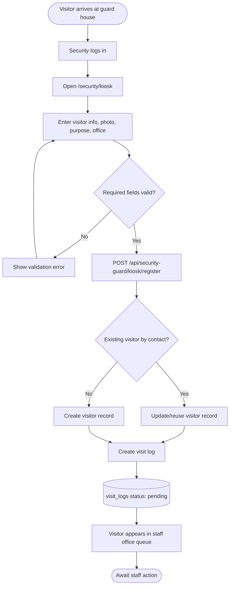
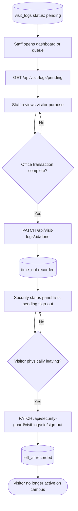
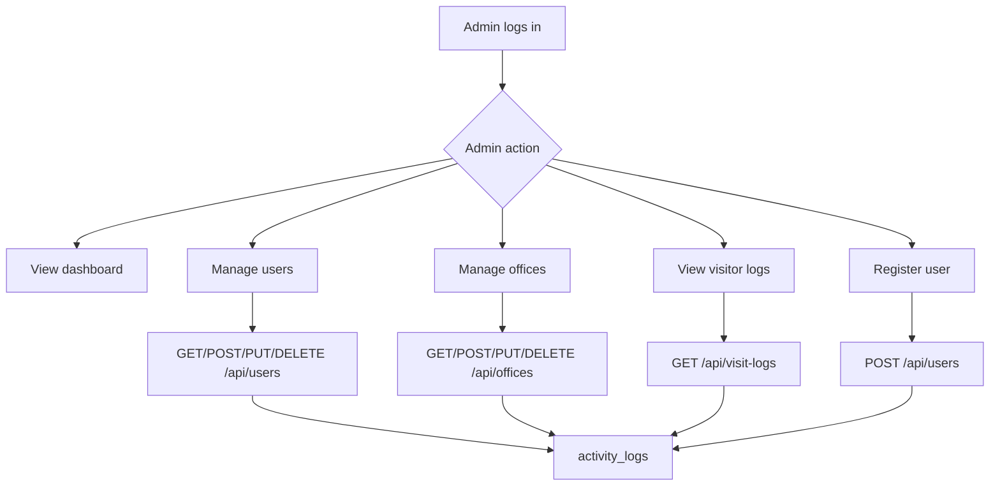
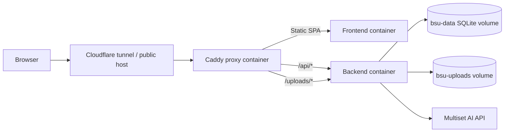

# BSU Visitor Flowcharts

This document contains Mermaid flowcharts for the main BSU Visitor system flows.

---

## 1. Whole-system context flow

```mermaid
flowchart TD
  Start([User opens system]) --> PublicCheck{Public or authenticated?}

  PublicCheck -->|Public visitor| PublicHome[Public home / office list]
  PublicHome --> PublicChoice{Visitor action}
  PublicChoice -->|Self-register for office| OfficeQR[/office/:id]
  PublicChoice -->|Navigate to office| OfficePicker[/office]
  OfficePicker --> NavAR[/navigate AR navigation]

  OfficeQR --> PublicRegister[Submit visitor details]
  PublicRegister --> PublicAPI[POST /api/public/office/:id/register]
  PublicAPI --> PendingLog[(visit_logs: pending)]

  NavAR --> MultisetProxy[/api/multiset proxy]
  MultisetProxy --> VPS[Multiset VPS localization]
  VPS --> RouteLine[Render AR pathway route]

  PublicCheck -->|Authenticated user| Login[/login]
  Login --> AuthAPI[POST /api/users/login]
  AuthAPI --> RoleCheck{Role}

  RoleCheck -->|Admin| AdminArea[Admin dashboard/users/offices/logs]
  RoleCheck -->|Staff| StaffArea[Staff dashboard/queue/logs]
  RoleCheck -->|Security| SecurityArea[Security kiosk/status/offices]
```

---

## 2. Guard-house kiosk registration flow



---

## 3. Staff processing and security sign-out flow



---

## 4. Public office QR self-registration flow

```mermaid
flowchart TD
  A([Visitor scans fixed office QR]) --> B[/office/:id]
  B --> C[GET /api/public/office/:id]
  C --> D{Office exists?}
  D -->|No| E[Show office not found]
  D -->|Yes| F[Show office visitor form]
  F --> G[Visitor enters name, contact, address, purpose]
  G --> H{Required fields valid?}
  H -->|No| I[Show validation error]
  I --> F
  H -->|Yes| J[POST /api/public/office/:id/register]
  J --> K{Existing visitor by contact?}
  K -->|Yes| L[Reuse visitor]
  K -->|No| M[Create visitor]
  L --> N[Create pending visit log]
  M --> N
  N --> O[Show confirmation]
  O --> P[Staff sees visitor in office queue]
```

---

## 5. AR navigation flow

```mermaid
flowchart TD
  A([Visitor needs directions]) --> B[Open /office]
  B --> C[Fetch public office list]
  C --> D[Select destination]
  D --> E[/navigate?to=id&name=name]
  E --> F{Browser supports camera/WebXR?}
  F -->|No| G[Show unsupported/error state]
  F -->|Yes| H[Request Multiset token via /api/multiset/token]
  H --> I[Start camera frame capture]
  I --> J[POST query image to /api/multiset/query-form]
  J --> K{Localized by VPS?}
  K -->|No| L[Keep scanning / show localization prompt]
  L --> I
  K -->|Yes| M[Convert Multiset map pose to Three.js world]
  M --> N[Find destination and nearest pathway nodes]
  N --> O[Render red route polyline]
  O --> P[Render live connector from camera to route]
  P --> Q([Visitor follows route])
```

---

## 6. Admin management flow



---

## 7. Deployment flow


