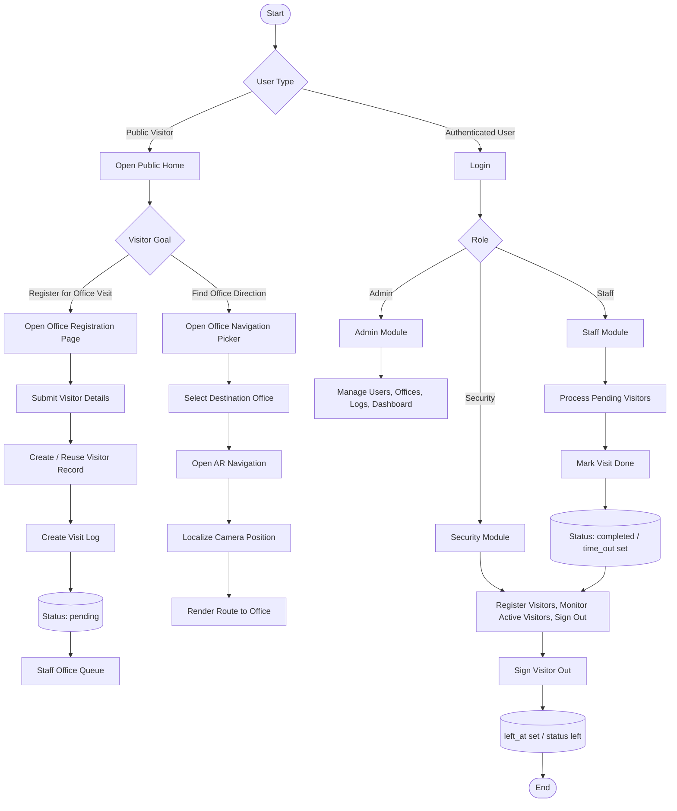
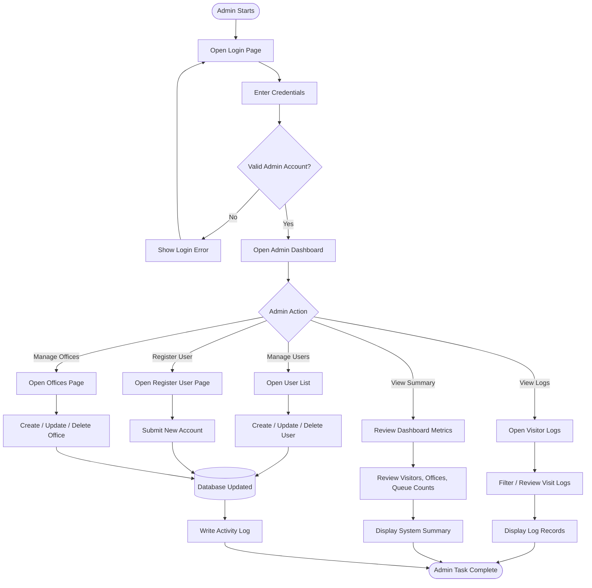
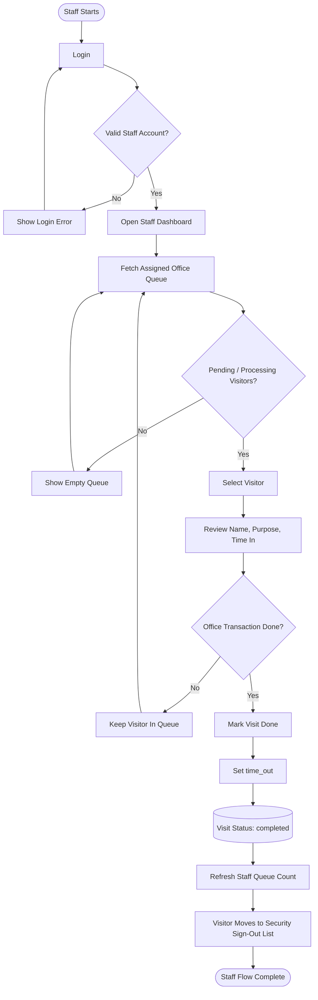
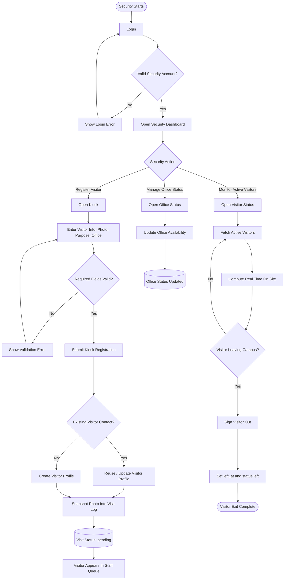
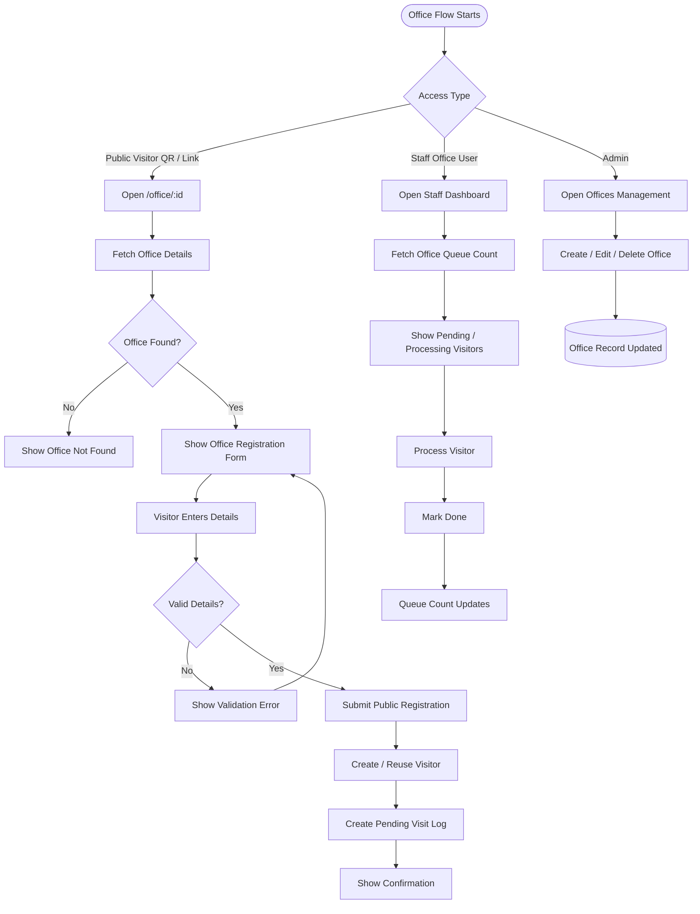
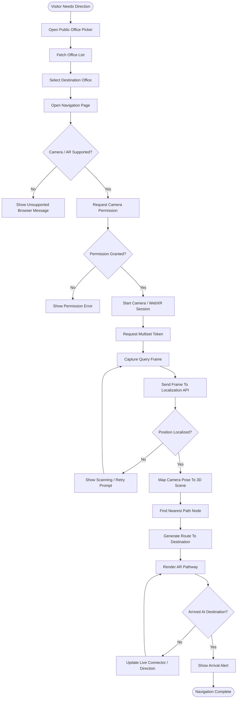
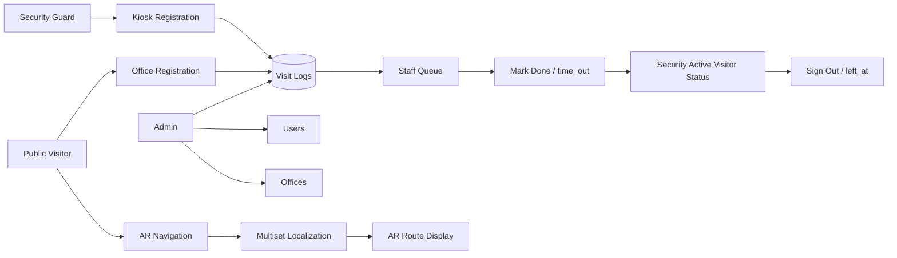

# BSU Visitor Role Flowcharts

Generated: 2026-08-01

This document contains focused Mermaid flowcharts for the BSU Visitor Management System modules: Admin, Staff, Security, Office, Navigation, and Whole System.

---

## 1. Whole System Flowchart

---

## 2. Admin Flowchart

---

## 3. Staff Flowchart

---

## 4. Security Flowchart

---

## 5. Office Flowchart

---

## 6. Navigation Flowchart

---

## 7. Module Relationship Summary

