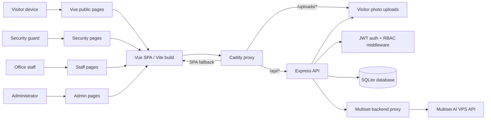
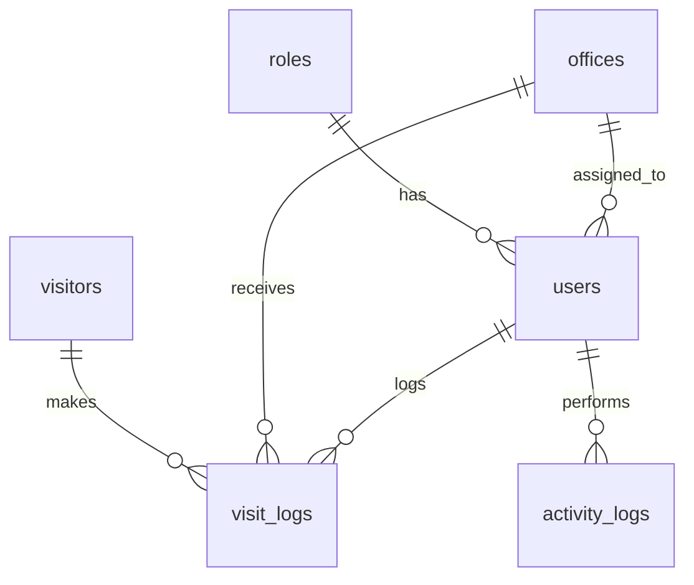
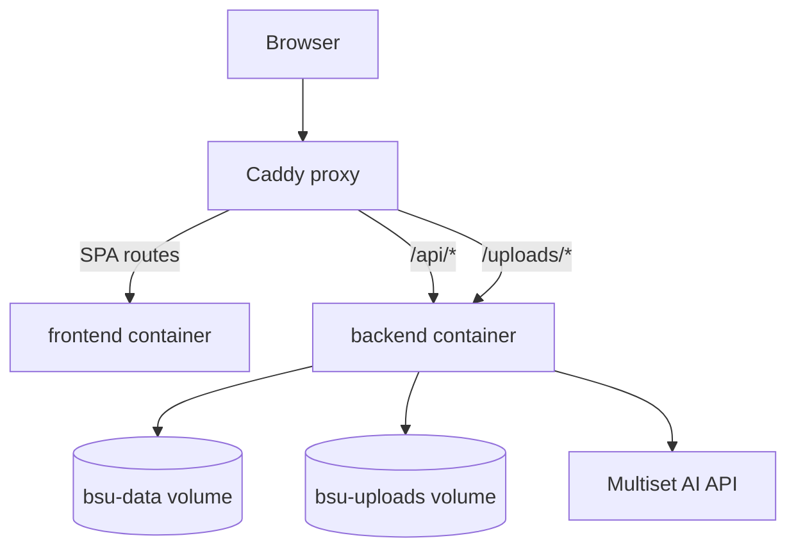

# BSU Visitor Management System Documentation

**Project:** BSU Visitor Management System  
**Institution:** Batangas State University - NEU  
**Repository:** `FireFlyDeveloper/bsu_visitor`  
**Local path:** `/root/tmp/bsu_visitor`  
**Last reviewed:** 2026-07-17

---

## 1. Project overview

BSU Visitor Management System is a role-based campus visitor management platform for handling visitor registration, office queueing, visitor status monitoring, security sign-out, and public office navigation.

The system supports three authenticated roles:

| Role | Main responsibility |
|---|---|
| Admin | Manage users, offices, dashboards, and visitor records |
| Staff | View office visitors, process waiting visitors, and mark visits done |
| Security | Register walk-in visitors, monitor visitors still inside campus, update office status, and sign visitors out |

It also has public visitor-facing pages:

| Public page | Purpose |
|---|---|
| `/` | Public home / office directory |
| `/office` | Office selection and AR navigation entry |
| `/office/:id` | Public fixed-QR office visitor registration |
| `/navigate` | WebXR / Multiset-based AR navigation |

---

## 2. Technology stack

| Layer | Technology |
|---|---|
| Frontend | Vue 3, Vue Router, Pinia, Tailwind CSS v4, Vite |
| Backend | Node.js, Express 5, Helmet, CORS, cookie-parser |
| Auth | JWT stored in httpOnly cookies, role middleware |
| Database | SQLite through `better-sqlite3` |
| Uploads | Multer disk uploads for visitor photos |
| AR Navigation | Multiset AI VPS SDK, Three.js/WebXR route rendering |
| Production stack | Docker Compose: backend, frontend, Caddy proxy |
| Proxy | Caddy reverse proxy: `/api/*` to backend, SPA fallback to frontend |

---

## 3. System architecture



### Production containers

| Service | Purpose | Notes |
|---|---|---|
| `backend` | Express API | Internal port `8765`; stores SQLite data and uploads in named volumes |
| `frontend` | Static Vue build | Built with `VITE_API_BASE=/api` |
| `proxy` | Caddy reverse proxy | Public HTTP/HTTPS entry point |

Named volumes:

| Volume | Stores |
|---|---|
| `bsu-data` | SQLite database files |
| `bsu-uploads` | Uploaded visitor photos |

---

## 4. Main modules

### 4.1 Authentication and role access

Source areas:

- Backend routes: `backend/src/routes/authRoutes.js`
- Backend middleware: `backend/src/middleware/authMiddleware.js`, `backend/src/middleware/roleMiddleware.js`
- Frontend router: `client/src/router/router.js`
- Frontend store: `client/src/store/user.js`

Flow:

1. User signs in through `/login`.
2. Backend validates username/password.
3. Backend issues JWT cookie.
4. Frontend fetches current user through `/api/users/me`.
5. Vue Router applies route guards.
6. Backend applies role middleware on protected API routes.

Role-gated route examples:

| Route | Role |
|---|---|
| `/admin/dashboard` | admin |
| `/admin/users` | admin |
| `/staff/dashboard` | staff |
| `/staff/visitors/queue` | staff |
| `/security/kiosk` | security |
| `/security/visitors/status` | security |
| `/security/offices/status` | security |

---

### 4.2 Guard-house kiosk visitor registration

Source areas:

- Frontend: `client/src/views/GuardPages/Kiosk.vue`
- Backend route: `POST /api/security-guard/kiosk/register`
- Backend controller: `backend/src/controllers/KioskController.js`
- Backend models: `Visitor.js`, `VisitLog.js`

Flow:

1. Security guard opens `/security/kiosk`.
2. Guard enters visitor name, contact number, address, photo, purpose, and destination office.
3. Backend validates required fields.
4. Backend creates or reuses a visitor record.
5. Backend creates a `visit_logs` row with status `pending`.
6. Staff assigned to the selected office sees the visitor in their dashboard or queue.

Validation notes:

- `fullname`, `contact_number`, `address`, and `office_id` are required.
- Visitor photo is required in the kiosk flow.
- Existing visitor records are reused by contact number.

---

### 4.3 Public office QR/self-registration

Source areas:

- Frontend: `client/src/views/PublicPages/OfficeVisitorAccess.vue`
- Backend route: `POST /api/public/office/:id/register`
- Backend controller: `backend/src/controllers/PublicController.js`

Flow:

1. Visitor scans a fixed office QR code or opens `/office/:id`.
2. Public page fetches office details from `/api/public/office/:id`.
3. Visitor enters name, contact number, address, and purpose.
4. Backend creates or reuses a visitor record.
5. Backend creates a pending visit log for that office.
6. Page shows confirmation.

Public registration does **not** require login and does **not** require a photo.

---

### 4.4 Staff visitor processing

Source areas:

- Frontend: `client/src/views/StaffPages/StaffDashboard.vue`
- Frontend: `client/src/views/StaffPages/VisitorQueue.vue`
- Backend route: `GET /api/visit-logs/pending`
- Backend route: `PATCH /api/visit-logs/:id/done`
- Backend controller: `VisitorLogController.markDone`

Flow:

1. Staff opens `/staff/dashboard` or `/staff/visitors/queue`.
2. System lists pending visitors for the staff member's assigned office.
3. Staff reviews visitor details and purpose.
4. Staff marks visit as done when the office transaction is completed.
5. Backend records `time_out` / completed state.
6. Security sees the visitor as ready for sign-out.

---

### 4.5 Security visitor monitoring and sign-out

Source areas:

- Frontend: `client/src/views/GuardPages/VisitorStatus.vue`
- Backend route: `GET /api/security-guard/visitors/active`
- Backend route: `PATCH /api/security-guard/visit-logs/:id/sign-out`
- Backend controller: `GuardSignOutController.js`

Flow:

1. Security opens `/security/visitors/status` or kiosk pending sign-out panel.
2. System lists visitors still inside campus.
3. Visitors marked done by staff appear as pending physical sign-out.
4. Security signs out the visitor when they leave the campus.
5. Backend records `left_at`.
6. Visitor no longer appears as active inside campus.

---

### 4.6 Office status management

Source areas:

- Frontend: `client/src/views/GuardPages/OfficeStatus.vue`
- Backend route: `PATCH /api/security-guard/office/:id/status`
- Backend model: `Office.js`

Security users can update office availability status. Public home and navigation pages use office data to show destination choices.

---

### 4.7 AR navigation / Multiset VPS flow

Source areas:

- Frontend route: `/office`
- Frontend route: `/navigate`
- Picker: `client/src/views/PublicPages/OfficeNavPicker.vue`
- AR view: `client/src/views/PublicPages/NavAr.vue`
- AR config: `client/src/config/arNavigation.js`
- Backend proxy: `backend/src/routes/multisetRoutes.js`

Flow:

1. Visitor opens `/office` and selects a destination office.
2. User proceeds to `/navigate?to=<office-id>&name=<office-name>`.
3. The browser opens the camera/WebXR flow.
4. Frontend requests Multiset auth through same-origin backend proxy.
5. Frontend submits camera query frames to `/api/multiset/query-form`.
6. Multiset returns VPS localization data.
7. Frontend maps Multiset coordinates into Three.js world space.
8. AR view renders a red route line using real map-space pathway waypoints.
9. Route guides from user's localized camera position to the selected destination.

Important current AR data:

- Map id: `MAP_GCEL3WD6ACQL`
- Destinations include Office of the Dean, Registrar, Cashier, and Guard House.
- Pathway coordinates are stored as `AR_PATHWAY_POINTS`.
- Credentials stay server-side and must not be exposed in frontend bundles.

---

## 5. Database entities

| Entity/table | Purpose |
|---|---|
| `roles` | Defines admin, staff, and security roles |
| `users` | Authenticated system users; may link to an office |
| `offices` | Campus destination offices and current status |
| `visitors` | Visitor profile information and photo path |
| `visit_logs` | Visit transaction: office, purpose, time-in, time-out, left-at, status |
| `activity_logs` | User activity trail for authenticated API operations |

Core relation:



---

## 6. API summary

| Area | Base path | Access |
|---|---|---|
| Auth/users | `/api/users` | public login/logout; protected user/admin routes |
| Visitors | `/api/visitors` | authenticated |
| Visit logs | `/api/visit-logs` | authenticated, role-limited for some actions |
| Offices | `/api/offices` | authenticated |
| Visitor status | `/api/visitor-status` | authenticated |
| Security guard | `/api/security-guard` | security role for kiosk/sign-out/office status |
| Public registration | `/api/public` | public |
| Public home | `/api/public-home` | public |
| Multiset proxy | `/api/multiset` | public same-origin proxy, server-side credentials |
| Roles | `/api/roles` | authenticated |

---

## 7. Deployment model

Production deployment uses Docker Compose with three services:



Deployment notes:

- Frontend is built with API base `/api` for same-origin calls.
- Backend is internal-only on port `8765`.
- Proxy exposes HTTP/HTTPS ports and routes traffic.
- Database and uploads are preserved through named Docker volumes.
- Multiset secrets are injected through environment variables, not committed.

---

## 8. Key workflows

### Workflow A: Walk-in visitor via guard kiosk

1. Security logs in.
2. Security opens kiosk.
3. Security registers visitor with photo and destination office.
4. Staff office receives pending visitor.
5. Staff marks visit done.
6. Security signs visitor out.
7. Visit history remains in logs.

### Workflow B: Visitor self-registers through fixed office QR

1. Visitor scans office QR.
2. Visitor enters details on public page.
3. System creates pending visit for office.
4. Staff processes the visitor.
5. Security signs visitor out if physical tracking is required.

### Workflow C: Visitor uses AR navigation

1. Visitor opens office picker.
2. Visitor selects destination.
3. Browser starts WebXR/Multiset VPS camera flow.
4. System localizes visitor position.
5. App renders route line using real map-space waypoints.
6. Visitor follows the pathway to the office.

---

## 9. Security and privacy notes

- JWT is stored in httpOnly cookies.
- Backend role middleware protects sensitive API routes.
- Visitor photos are stored server-side under uploads.
- Multiset credentials are server-side only.
- Same-origin proxy avoids exposing direct third-party API credentials in the browser.
- Production secrets must be provided through `.env` / Docker environment variables and never committed.

---

## 10. Known implementation notes

- The current branch has uncommitted AR/navigation edits in `client/src/config/arNavigation.js`, `NavAr.vue`, and `OfficeNavPicker.vue`.
- Public AR navigation depends on device/browser WebXR support and Multiset VPS localization quality.
- The existing project has prior deployment fixes for CORS, Cloudflare/Caddy routing, and same-origin API proxying.
- Public QR registration and guard-kiosk registration are intentionally separate flows.

---

## 11. Quick commands

```bash
# install root tooling
npm install

# install backend and frontend dependencies
(cd backend && npm install)
(cd client && npm install)

# seed local SQLite database
npm run seed

# run backend + frontend in development
npm run dev

# run API smoke test against running backend
npm run test:api

# build frontend
(cd client && npm run build)
```
