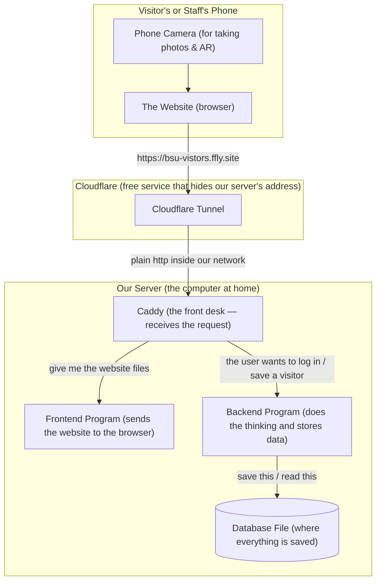
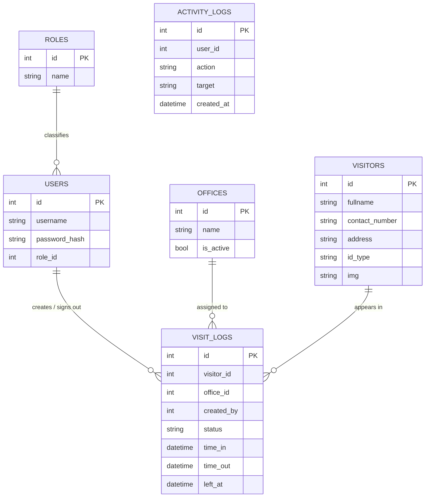
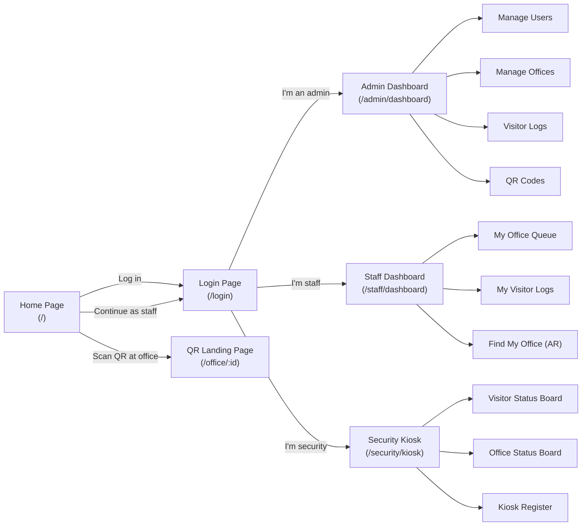
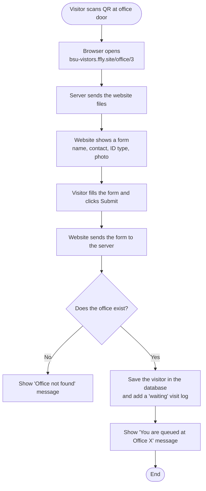
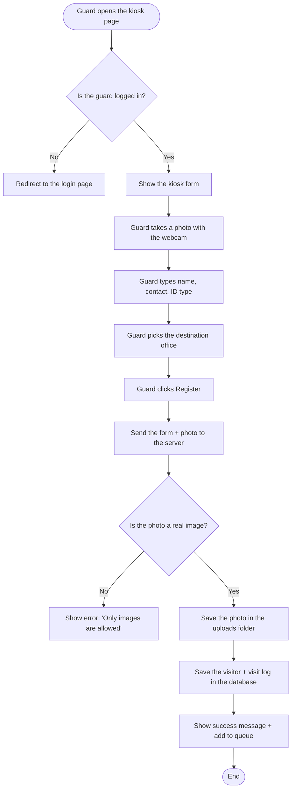
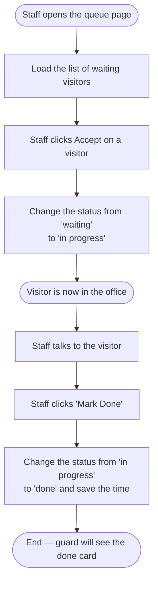
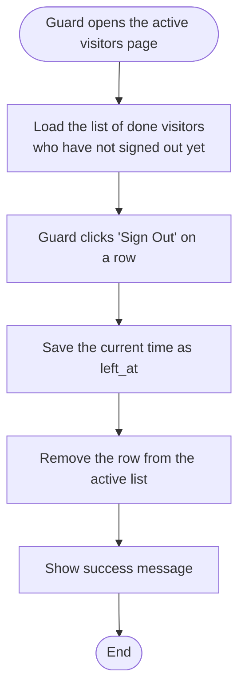
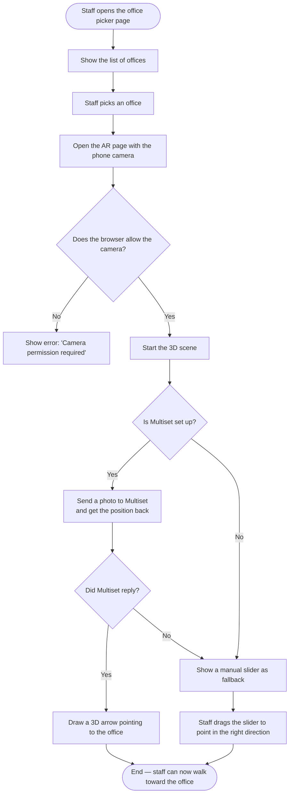
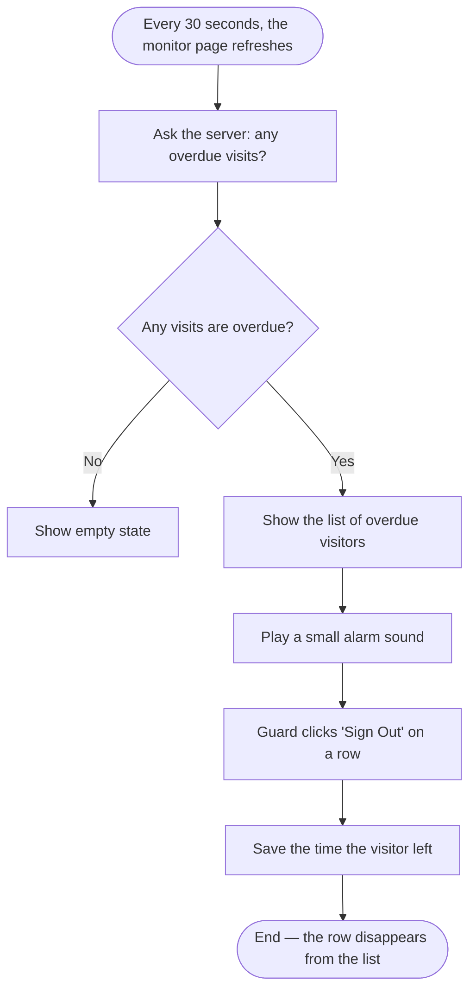
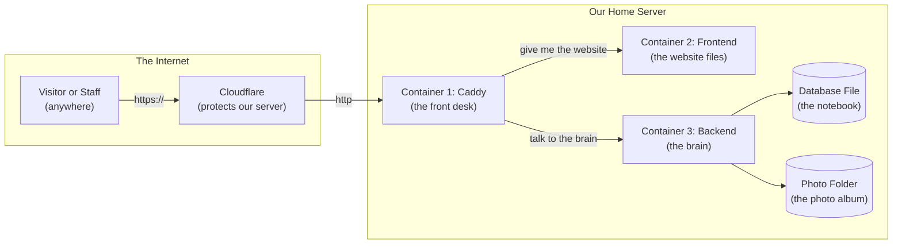

# CHAPTER 4
# SOFTWARE DESIGN
## (Plain-Language Version for a 3rd-Year Student Research Paper)

> **How to read this chapter.** This is the same software design described in a normal way. Technical words are explained the first time they appears. Think of it as the "explain it to a friend" version of Chapter 4.

---

## 4.1 Introduction

This chapter is about **how the BSU Visitor Management System was designed before it was built**. Designing before building is important because it is much cheaper to fix a problem on paper than in code. The chapter shows:

- How the whole system fits together (the "big picture")
- What the different parts of the system do
- How the data is stored
- How the user interface looks
- What happens step-by-step when a visitor, guard, staff, or admin uses the system

The system is a **web application**. That means the user opens a website in their phone or computer browser, and the website talks to a **server** somewhere else. The server is a computer that stores all the data and runs the rules. In our project, the server also has an **AR (Augmented Reality)** feature for staff to find their way to an office inside the campus.

> **Why a web app, not a mobile app?** A web app works on any phone that has a browser — Android, iPhone, even a laptop. We do not have to build a separate app for iOS and Android. The same code works everywhere.

---

## 4.2 System Architecture (How the Pieces Fit Together)

### 4.2.1 The Big Picture (in simple terms)

Imagine a restaurant:
- The **waiter** takes your order (this is the **browser** you use to open the website)
- The **kitchen** prepares your food (this is the **server** that runs the system)
- The **refrigerator and pantry** store the ingredients (this is the **database**)
- The **manager** makes sure the kitchen follows the rules (this is the **security and access control**)

In our system:
- The **waiter (browser)** is the visitor's or staff's phone or laptop.
- The **kitchen (server)** is one computer program written in Node.js (a popular tool for building web servers).
- The **refrigerator (database)** is a small file in SQLite format. SQLite is a type of database that lives in one single file, like a digital notebook.
- The **manager (security)** is the login system that checks who is allowed to do what.

### 4.2.2 The Three Layers

The system is split into **three layers**. Each layer has one job:

| Layer | What it does | What we used to build it |
|---|---|---|
| **Presentation layer** (the "face") | Shows buttons, forms, and visitor lists to the user | Vue 3, a popular JavaScript tool for building websites |
| **Application layer** (the "brain") | Receives the user's actions, applies the rules, and decides what to do | Node.js + Express, a tool for building the "kitchen" |
| **Data layer** (the "memory") | Stores all the visitors, offices, and user accounts in a file | SQLite (a simple database that lives in one file) |

**Why split into three layers?** Because it is easier to fix one layer without breaking the others. If we want to change the look of the website, we only change the presentation layer. The data and the rules stay the same.

### 4.2.3 The Full Picture Diagram

The picture below shows the path the data takes when a visitor opens the website:



**Reading the picture:**

1. The visitor types `bsu-vistors.ffly.site` in their phone.
2. **Cloudflare** receives the request. Cloudflare is a free service that protects websites from hackers and hides where the server is located.
3. Cloudflare forwards the request to a small program called **Caddy** on our server. Caddy is the "front desk" — it decides whether the user wants the website files or wants to talk to the backend.
4. If the user wants the website files, Caddy gives them to the **frontend** (which is just a folder of HTML, CSS, and JavaScript files).
5. If the user wants to log in or save a visitor, Caddy forwards the request to the **backend**, which is the "brain" of the system.
6. The **backend** reads from or writes to the **database**.

> **Why Caddy?** Caddy is a small program that acts as a **reverse proxy**. That is a fancy way of saying "it stands at the door, greets visitors, and sends them to the right room." Without Caddy, the browser would get confused because the website and the backend would look like two different websites. Caddy makes them look like one website, so the browser is happy.

---

## 4.3 The Different Parts of the System (Modules)

A **module** is a small part of the system that has one job. Think of a car: it has an engine module, a brake module, a steering module, and a radio module. Each module does one thing well.

### 4.3.1 The Backend Modules (the "Kitchen Staff")

| Module | Job |
|---|---|
| `server.js` | Turns on the kitchen. Sets up the rules (like "no shirt, no shoes, no service" but for web requests). |
| `authRoutes.js` | Handles login and logout. Gives users a "name tag" (called a JWT token) when they log in. |
| `visitorLogRoutes.js` | Handles everything about a visitor's visit: registering, signing in, signing out, marking as done. |
| `visitorRoutes.js` | Handles the list of all visitors (the "address book" of everyone who ever came). |
| `officeRoutes.js` | Handles the list of offices (Registrar, Cashier, etc.). |
| `visitorStatusRoutes.js` | Shows the live status of visitors — who is waiting, who is being served. |
| `securityGuardRoutes.js` | The tools for the security guard at the gate (register visitor, sign out). |
| `publicHomeRoutes.js` | The public pages that anyone can see (like the office list on the monitor). |
| `publicRoutes.js` | The page visitors see when they scan the QR code on an office door. |
| `roleRoutes.js` | The list of roles (admin, staff, security). |
| **Controllers** | Small helper programs. One controller per route file. They do the actual work — like "create visitor" or "mark as done." |
| **Models** | The way the backend talks to the database. Each model is one table (like a sheet in Excel). |
| **Middleware** | The "security guards at the kitchen door" — they check the user's name tag and role before letting them in. |
| **Database** | The actual file where all data is saved. |

### 4.3.2 The Frontend Modules (the "Dining Area")

| Module | Job |
|---|---|
| `main.js` | Starts the website. |
| `App.vue` | The main shell — every page sits inside this. |
| `router/` | The list of pages and which URL goes to which page. (Like a menu in a restaurant.) |
| `store/` | The shared memory of the website. When one page learns something (like "the user just logged in"), it tells the store, and every other page knows. |
| `layouts/AdminLayout.vue` | The top bar (with the BSU red color) that every logged-in page shares. |
| `views/AuthPages/` | The login page. |
| `views/AdminPages/` | The pages only the admin can see: dashboard, users, offices, register. |
| `views/StaffPages/` | The pages only the staff can see: their dashboard, their queue of visitors, their logs. |
| `views/GuardPages/` | The pages only the security guard can see: the kiosk, the visitor status board, the office status board. |
| `views/VisitorPages/` | The pages that show visitor information. |
| `views/PublicPages/` | The pages that anyone can see without logging in: the home page, the QR landing page, the AR wayfinding. |
| `views/ErrorPages/` | The "You are not allowed" page. |
| `composables/` | Reusable helper code, like a recipe you use in many dishes. |
| `components/` | Small reusable pieces of the website, like the toast popup or the navigation bar. |

---

## 4.4 Database Design (How Data is Stored)

The system uses **SQLite**. SQLite is a database that lives in a single file. Think of it as a digital notebook with many sheets. Each sheet is a **table**.

### 4.4.1 The Tables (the "Sheets" in the Notebook)

The system has six sheets:

| Sheet (table) | What it stores |
|---|---|
| `users` | The login accounts (admin, staff, security). |
| `roles` | The three roles: admin, staff, security. |
| `offices` | The offices in the campus (Registrar, Cashier, etc.). |
| `visitors` | Every person who has ever visited the campus. |
| `visit_logs` | Every visit, with a timestamp. One visit = one row. |
| `activity_logs` | A history of who did what and when (the "audit trail"). |

### 4.4.2 How the Sheets are Connected (ERD)

The picture below is called an **ERD (Entity-Relationship Diagram)**. It shows how the sheets are connected.



**Reading the ERD:**

- A **USER** (like a guard) creates many VISIT_LOGS (one row per visitor they register).
- A **VISITOR** can appear in many VISIT_LOGS (because the same person can visit many times).
- A **VISIT_LOG** is connected to one VISITOR and one OFFICE.
- The little ||--o{ symbol means "one user can have many visit logs" (the `o{` is the "many" side).

### 4.4.3 What Each Sheet Looks Like

#### The `users` sheet

| Column | What it stores |
|---|---|
| `id` | A unique number for each user (like a roll number). |
| `username` | The login name. |
| `password_hash` | The password, but scrambled so even we cannot read it. |
| `role_id` | Which role this user is (admin, staff, or security). |
| `created_at` | When the account was created. |

#### The `visitors` sheet

| Column | What it stores |
|---|---|
| `id` | A unique number for each visitor. |
| `fullname` | The full name. |
| `contact_number` | Phone number. |
| `address` | Home address. |
| `id_type` | The type of ID they showed (e.g., Driver's License, Passport). |
| `img` | The filename of their photo. |

#### The `visit_logs` sheet (this is the most important one)

| Column | What it stores |
|---|---|
| `id` | A unique number for each visit. |
| `visitor_id` | Which visitor (links to the `visitors` sheet). |
| `office_id` | Which office they are going to (links to the `offices` sheet). |
| `created_by` | Which guard registered them (links to the `users` sheet). |
| `status` | Where the visit is right now: `waiting`, `in_progress`, `done`, or `signed_out`. |
| `time_in` | The exact time the visitor entered the gate. |
| `time_out` | The exact time the staff marked the visit as done. |
| `left_at` | The exact time the guard signed the visitor out. |

> **Why so many timestamps?** So the admin can see exactly how long each visit took, and so the security desk can spot visitors who forgot to sign out (we call those "overdue").

---

## 4.5 How the Frontend Talks to the Backend (the API)

The frontend and the backend cannot talk directly. They have to send messages in a specific format. The format used in this project is called a **REST API**.

> **What is an API?** Think of it as a menu in a restaurant. The customer (frontend) looks at the menu and orders a dish (sends a request). The kitchen (backend) cooks the dish and serves it (sends a response). The menu is the **API** — it lists every dish the kitchen can make and what the customer has to say to order it.

### 4.5.1 The Menu (List of API Endpoints)

An **endpoint** is one item on the menu. Each endpoint is a specific URL that does one specific thing. The table below shows every endpoint in our system.

| Action | URL | Who can use it | What it does |
|---|---|---|---|
| `GET` | `/api/health` | Anyone | Says "I am alive" so we can check the server is running. |
| `POST` | `/api/users/login` | Anyone | Logs the user in and gives them a name tag. |
| `POST` | `/api/users/logout` | Logged in | Logs the user out. |
| `GET` | `/api/users/me` | Logged in | Returns the current user's info. |
| `GET` | `/api/users/all-with-activity` | Admin only | Lists all users and what they last did. |
| `POST` | `/api/users` | Admin only | Creates a new user. |
| `PATCH` | `/api/users/:id` | Admin only | Edits a user. |
| `GET` | `/api/offices` | Logged in | Lists all offices. |
| `POST` | `/api/offices` | Admin only | Creates a new office. |
| `GET` | `/api/visitors` | Logged in | Lists all visitors. |
| `POST` | `/api/visitors` | Logged in | Creates a new visitor. |
| `GET` | `/api/visit-logs` | Logged in | Lists all visit logs. |
| `POST` | `/api/visit-logs` | Security only | Creates a new visit log at the kiosk. |
| `PATCH` | `/api/visit-logs/:id/sign-out` | Security only | Signs the visitor out. |
| `PATCH` | `/api/visit-logs/:id/status` | Staff or admin | Changes the status (waiting → in progress → done). |
| `GET` | `/api/visit-logs/overdue` | Logged in | Lists visits that forgot to sign out. |
| `GET` | `/api/security-guard/visitors/active` | Security only | Lists the visitors currently inside. |
| `POST` | `/api/security-guard/kiosk/register` | Security only | Registers a new visitor in one go. |

**Reading the table:**

- The four words in capital letters — `GET`, `POST`, `PATCH`, `DELETE` — are called **HTTP methods**. They tell the backend what the user wants to do.
  - `GET` = "Please show me" (does not change anything)
  - `POST` = "Please create a new one"
  - `PATCH` = "Please change an existing one"
  - `DELETE` = "Please remove it"
- The `:id` part is a placeholder. If the URL is `/api/visitors/5`, it means the visitor with id = 5.

### 4.5.2 How Login Works (Authentication)

> **Authentication** is a long word that just means "checking who you are."

When a user logs in:

1. They type their username and password.
2. The frontend sends them to the backend.
3. The backend checks if the username and password are correct.
4. If yes, the backend gives the user a **JWT token** (a long random string that acts like a name tag). The token is stored in a **cookie**, which is a tiny file inside the browser.
5. From now on, every request the frontend sends automatically includes the cookie, so the backend knows who the user is.

> **Why use a cookie?** Because it is safer. The JavaScript code in the browser cannot read the cookie (it is `httpOnly`, which means "for the browser only, not for code"). This protects the user even if a hacker somehow runs bad code on the page.

### 4.5.3 Who Can Do What (Authorization)

> **Authorization** is a long word that just means "checking what you are allowed to do."

There are three roles:

- **Admin** — can do everything: create users, create offices, see all logs, export data.
- **Staff** — can see their office's queue, mark visitors as in-progress or done.
- **Security** — can register visitors at the kiosk, sign them out, see the active list.

The backend checks the role on every request. If a staff tries to create a user, the backend says **"403 — Forbidden"** and refuses.

### 4.5.4 What Happens When Something Goes Wrong

When the backend runs into a problem, it sends back a JSON message that looks like this:

```json
{
  "message": "Only images are allowed",
  "status": 400
}
```

The number is the **HTTP status code**. The common ones are:

| Code | Meaning | Example |
|---|---|---|
| 200 | OK — everything worked. | Login successful. |
| 400 | Bad Request — the user sent something wrong. | Uploaded a PDF instead of a photo. |
| 401 | Unauthorized — the user did not log in. | Tried to view a page without a name tag. |
| 403 | Forbidden — the user is logged in but not allowed. | A staff tried to create a user. |
| 404 | Not Found — the URL does not exist. | Visited `/api/unicorns`. |
| 500 | Internal Server Error — something broke on the server. | The database file is locked. |

---

## 4.6 How the Website Looks (User Interface Design)

The **User Interface (UI)** is the part the user sees and touches. In our project, the UI is built with **Vue 3**, which is a popular tool for making websites. We also use **Tailwind CSS** for styling, which is like a big box of pre-made design pieces (colors, spacing, rounded corners).

### 4.6.1 The Pages of the Website

The website has different pages for different users. The picture below shows how they are connected.



### 4.6.2 The Look and Feel

All logged-in pages share the same top bar — a sticky red bar (BSU maroon, color `#8C1D0E`) with the BSU logo on the left and the user's name on the right. The content sits in the middle of the page. There is a small popup at the bottom of the screen for success and error messages (we call it a **toast**).

The home page and the QR landing page do **not** show this top bar. This is so visitors who scan a QR code do not see the admin menu and get confused.

### 4.6.3 The AR Wayfinding (Finding Your Office Indoors)

The **AR (Augmented Reality)** part is a small bonus feature for staff. When a staff member is logged in and goes to `/office`, they can pick the office they want to find. Then the website opens the phone's camera and draws a 3D arrow on top of the camera view, pointing toward the office.

Two ways the system knows where the staff member is:

- **Multiset AI (the smart way)** — a free service that looks at the camera picture and figures out the position. The website sends the picture to Multiset's server, and Multiset sends back "you are here, the office is that way."
- **Manual slider (the fallback)** — if Multiset is not set up or not working, the staff member can drag a slider to set the direction themselves. It is less fancy but it always works.

> **Why is this page hidden behind login?** Because the camera and the office location are private. We do not want random visitors to know where the offices are or to be able to use the camera feature.

---

## 4.7 What Happens Step-by-Step (the Flowcharts)

This section shows the most important things the system does, drawn as flowcharts. A **flowchart** is a picture that uses shapes to show the steps:

| Shape | Meaning |
|---|---|
| **Rounded rectangle** (a pill shape) | The start or end of the process. |
| **Rectangle** | An action the system does. |
| **Diamond** | A question with a yes/no answer. The flow splits based on the answer. |
| **Parallelogram** (a slanted rectangle) | Data going in or out, like a form or a database row. |

### 4.7.1 When a Visitor Scans the QR Code on an Office Door

This is the most common way a visitor enters the system. The visitor walks to an office, scans the QR code stuck on the door, fills out a short form, and gets added to the office's queue.



**Reading the flowchart:**

- The visitor starts at the top (the rounded rectangle).
- The system does a few actions (the rectangles).
- There is one decision point (the diamond "Does the office exist?"). If no, it shows an error. If yes, it saves the data.
- The visitor ends at the bottom (the rounded rectangle).

### 4.7.2 When a Security Guard Registers a Walk-in Visitor

This is when a visitor walks in without a QR code (or their phone is dead). The guard fills out the form on the kiosk computer.



### 4.7.3 When Staff Accepts a Visitor and Marks Them Done

This is what happens at the office. The staff sees the visitor in the queue, clicks "Accept" (which means the visitor is now in the office), and later clicks "Mark Done" when the visit is finished.



### 4.7.4 When the Guard Signs a Visitor Out

After the staff marks the visit as done, the guard at the gate needs to sign the visitor out. This is the "you are leaving the campus" step.



### 4.7.5 When the Admin Creates a New User

This is for the admin to add a new staff or new security guard.

```mermaid
flowchart TD
    A([Admin opens the users page]) --> B[Load the list of all users]
    B --> C[Admin clicks 'Add User']
    C --> D[Show the form<br/>username, password, role]
    D --> E[Admin fills and submits]
    E --> F[Send the form to the server]
    F --> G{Is the username taken?}
    G -->|Yes| H[Show error: 'Username taken']
    G -->|No| I[Encrypt the password<br/>(scramble it so it is safe)]
    I --> J[Save the new user in the database]
    J --> K[Show success message and add to the list]
    K --> L([End])
```

### 4.7.6 When Staff Uses the AR Wayfinding

This is the bonus feature for staff to find their way around the campus.



### 4.7.7 The Overdue Monitor (Visitors Who Forgot to Sign Out)

Sometimes a visitor leaves without signing out at the gate. The system has a small "watchdog" that checks every 30 seconds for visits that have been done for more than 30 minutes and have not been signed out. It plays a small alarm sound on the security monitor so the guard can follow up.



---

## 4.8 How the System Stays Safe (Security Design)

The system has several layers of safety:

| Safety concern | How we protect it |
|---|---|
| **Passwords in the database** | We never store the actual password. We use **bcrypt** to scramble it. Bcrypt is a tool that takes a password like `"admin123"` and turns it into a long random-looking string. Even if a hacker steals the database, they cannot read the passwords. |
| **The login name tag (JWT token)** | The name tag is stored in a special cookie that JavaScript code cannot read. This is called an **httpOnly** cookie. So even if a hacker runs bad code on the page, they cannot steal the name tag. |
| **People trying to log in from another website (CSRF)** | The cookie has a setting called **SameSite=Lax** which means "only send this cookie if the user is on our website, not on a different one." |
| **Bad file uploads** | When the guard uploads a photo, the system checks if it is really an image. If it is a PDF or a Word document, the system says **"400 — Only images are allowed."** |
| **Hackers trying to break the database (SQL injection)** | The system never builds a database query by sticking strings together (which is how hackers sneak in). Instead, it uses **prepared statements** — a safer way to talk to the database. |
| **Visitor photos** | The photos are stored in a private folder (a Docker volume called `bsu-uploads`). They are served read-only, so no one can change them. |
| **Mixed content (a security warning in the browser)** | All traffic goes through Caddy and Cloudflare, so the browser only ever sees one website address (`https://bsu-vistors.ffly.site`). There is no "insecure content" warning. |

---

## 4.9 How the System is Set Up (Deployment Topology)

**Deployment** is the fancy word for "putting the system on a real computer so people can use it." The system is deployed on a small home server, packaged in **Docker** containers.

> **What is Docker?** Docker is a tool that packs a program and everything it needs into a small box called a **container**. The container can run on any computer. It is like a lunchbox: you can take the same lunchbox to work, to school, or to a picnic, and the food inside is the same.

There are three containers (three lunchboxes) in this system:



The three containers are:

1. **Caddy container** — the front desk. Receives every request and sends it to the right container. Listens on port `8080` (regular web traffic) and port `8443` (encrypted web traffic).
2. **Frontend container** — just the website files (HTML, CSS, JavaScript). It does not have a public door — only Caddy can talk to it.
3. **Backend container** — the brain. Handles all the logic. It also does not have a public door — only Caddy can talk to it. The database and the photo folder are stored in two special folders that survive even if the container is restarted.

> **Why three containers and not one?** Because if one container breaks (say, the backend has a bug), the other two are not affected. The website is still up. And if we need to update one container, we do not have to take the others down.

---

## 4.10 Summary

The BSU Visitor Management System is built as a **web application with three parts**:

- A **frontend** (the website) built with Vue 3 and Tailwind CSS
- A **backend** (the brain) built with Node.js and Express
- A **database** (the notebook) built with SQLite

All three parts sit on a home server, packaged in three Docker containers, and they are protected by Cloudflare. The system has:

- **Three roles** (admin, staff, security) so that each user only sees what they need to see
- **A QR code system** so visitors can register themselves from their phone
- **A kiosk** for the security guard to register walk-in visitors
- **A queue and dashboard** for staff to manage the visitors at their office
- **An overdue monitor** so no visitor is forgotten
- **A small AR feature** so staff can find their way to the right office

The whole system was tested with **30 smoke tests and 45 integration tests** to make sure every part works the way it is supposed to. The system is currently live at `https://bsu-vistors.ffly.site/`.
