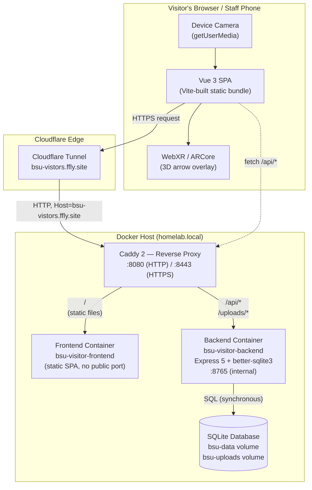
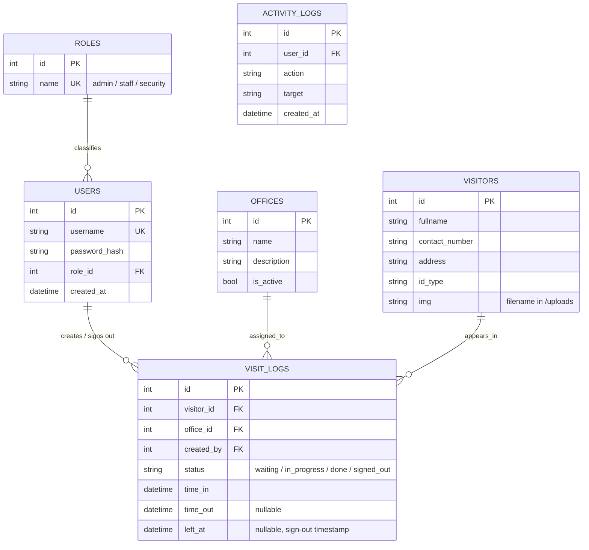
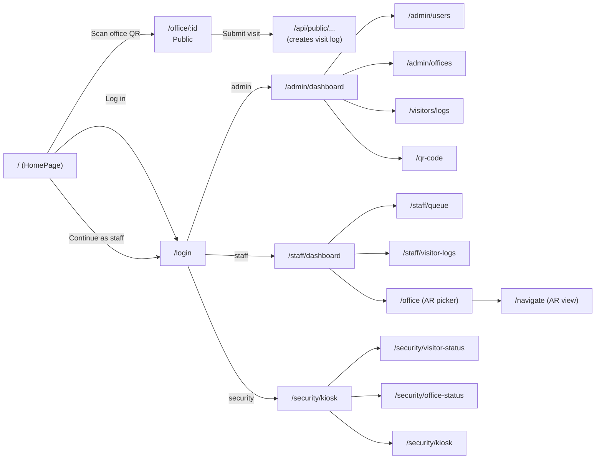
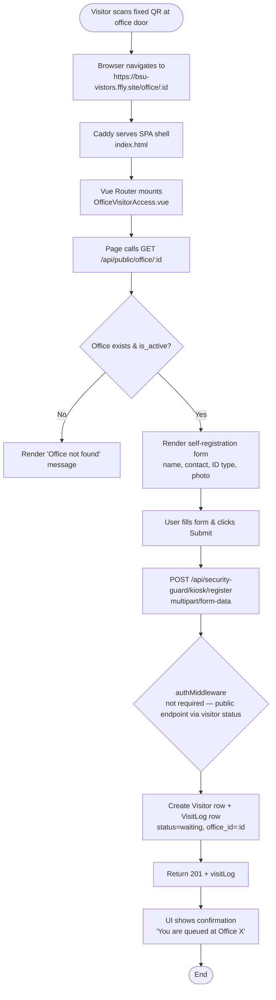
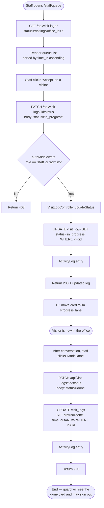
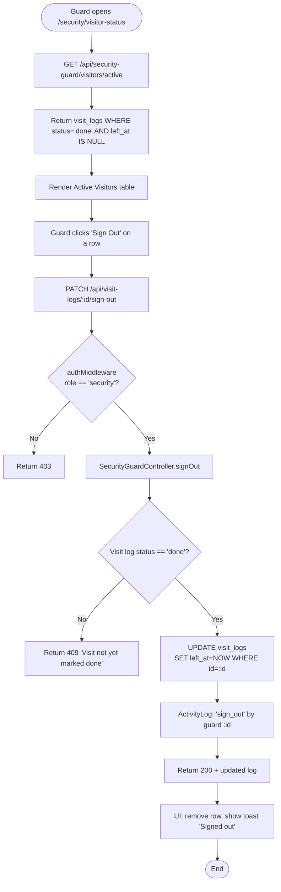
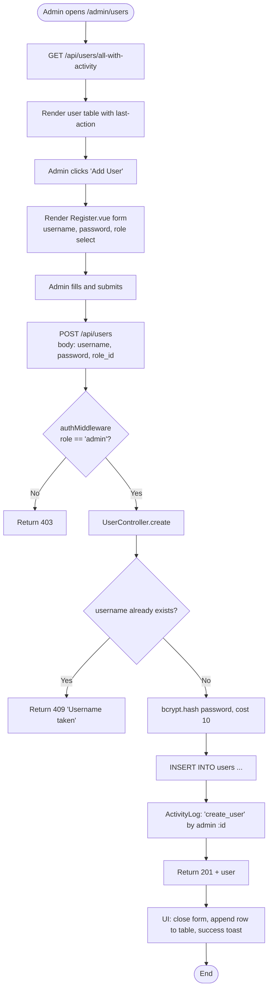
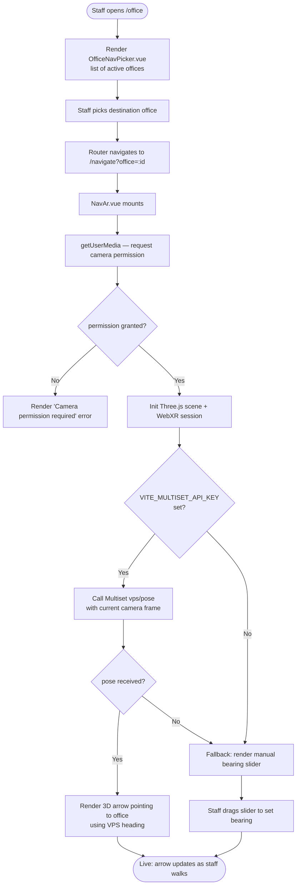
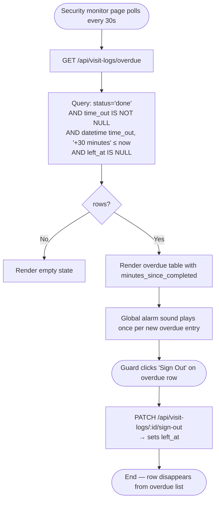
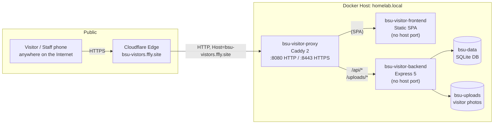

# CHAPTER 4
# SOFTWARE DESIGN

## 4.1 Introduction

This chapter presents the software design of the **Batangas State University (BSU) Visitor Management System**, a capstone project developed to digitize and streamline the campus visitor lifecycle — from registration at the security kiosk, through office assignment and queueing, to the issuance of a digital pass and sign-out. The system is delivered as a three-tier web application with an AR-assisted navigation layer, intended to replace the current paper-based logbook used at the NEU gate.

The design follows the **Model–View–Controller (MVC)** pattern on the server side and the **Component-Based Architecture** pattern on the client side, with **Representational State Transfer (REST)** as the contract between them. The chapter is organized as follows: high-level system architecture, the three-tier deployment topology, the database design, the API surface, the user-interface design, the data-flow of the principal use cases, and the flowchart notation used throughout.

---

## 4.2 System Architecture

The application is decomposed into three logical layers — **Presentation**, **Application Logic**, and **Data** — connected over a single reverse-proxied origin. This decomposition was chosen to enforce a clean separation of concerns: the Presentation layer (Vue 3 SPA) handles only rendering and user input; the Application Logic layer (Express 5 REST API) enforces business rules, authentication, and authorization; and the Data layer (SQLite via `better-sqlite3`) provides durable, transactional storage.

### 4.2.1 High-Level Architecture Diagram

The diagram below shows the production topology. The browser, the Caddy reverse proxy, the Node.js API, and the SQLite database each sit in their own trust zone. The browser and proxy communicate over HTTPS (TLS terminated at the Cloudflare edge); everything below the proxy is plain HTTP on an internal Docker network.



### 4.2.2 Architectural Style

| Concern | Style / Pattern | Rationale |
|---|---|---|
| Frontend architecture | Component-Based (Vue 3 SFC) | Encapsulation of state + template per view; enables lazy-loaded routes |
| Backend architecture | Model–View–Controller (MVC) | Mature, predictable; clear boundary between persistence (`models/`), transport (`routes/`+`controllers/`), and policy (`middleware/`) |
| Inter-tier contract | REST over JSON | Stateless, cacheable, tool-friendly (curl / OpenAPI / smoke tests) |
| State management (client) | Pinia stores (`store/visitor.js`, `store/user.js`, `store/visitorLog.js`) | Single source of truth per domain; easy to hydrate and test |
| Authentication | JWT in `httpOnly` + `SameSite=Lax` cookie, issued by `/api/users/login` | XSS-safe token storage; cookie auto-sent on same-origin requests |
| Authorization | Role-Based Access Control (RBAC) via `roleMiddleware` | Three roles — `admin`, `staff`, `security` — resolved per-request against the `roles` table |
| Deployment | Three-container stack behind a single Caddy reverse proxy | Eliminates mixed-content and CORS errors because the browser only sees one origin |

---

## 4.3 System Modules

The software is partitioned into the following modules, each owning a single concern. Cross-module calls happen only through the API boundary or through Pinia stores — there are no direct database calls from the frontend, and no direct template rendering from the backend.

### 4.3.1 Backend Modules (Node.js / Express)

| Module | Path | Responsibility |
|---|---|---|
| `server.js` | `backend/src/server.js` | Process bootstrap, middleware stack (`helmet`, `cors`, `cookie-parser`, JSON body parser), router mounting, error handler |
| `authRoutes.js` | `backend/src/routes/authRoutes.js` | `POST /api/users/login`, `POST /api/users/logout`, `GET /api/users/me` — issue and validate the JWT session cookie |
| `visitorLogRoutes.js` | `backend/src/routes/visitorLogRoutes.js` | Visit-log lifecycle: create, sign-out, mark-done, list, export, overdue |
| `visitorRoutes.js` | `backend/src/routes/visitorRoutes.js` | Visitor CRUD with photo upload (Multer) |
| `officeRoutes.js` | `backend/src/routes/officeRoutes.js` | Office CRUD + availability toggle |
| `visitorStatusRoutes.js` | `backend/src/routes/visitorStatusRoutes.js` | Live status of visitors per office (used by the kiosk display) |
| `securityGuardRoutes.js` | `backend/src/routes/securityGuardRoutes.js` | Kiosk register, sign-out, active-visitor list (security-only) |
| `publicHomeRoutes.js` | `backend/src/routes/publicHomeRoutes.js` | Public, unauthenticated endpoints for the public kiosk / monitor |
| `publicRoutes.js` | `backend/src/routes/publicRoutes.js` | Public per-office fixed-QR landing page (`/api/public/office/:id`) |
| `roleRoutes.js` | `backend/src/routes/roleRoutes.js` | Role lookup (admin only) |
| **Controllers** | `backend/src/controllers/` | One controller per route file: `*Controller.js` — pure async functions, no persistence calls |
| **Models** | `backend/src/models/` | `better-sqlite3` prepared statements: `User.js`, `Visitor.js`, `VisitLog.js`, `Office.js`, `VisitorStatus.js`, `ActivityLog.js` |
| **Middleware** | `backend/src/middleware/` | `authMiddleware` (verify JWT cookie), `roleMiddleware` (admin/staff/security gate), `multer` upload |
| **Database** | `backend/src/database/` | Schema migrations (`create*Table.js`), `seed.js`, `migrateLeftAt.js` |

### 4.3.2 Frontend Modules (Vue 3)

| Module | Path | Responsibility |
|---|---|---|
| `main.js` | `client/src/main.js` | App bootstrap, Pinia install, router install |
| `App.vue` | `client/src/App.vue` | Root component — mounts `<router-view />` and the global `<Toast />` |
| `router/` | `client/src/router/` | All client-side routes + `auth.middleware.js` (guest guard) + `role.middleware.js` (role guard) |
| `store/` | `client/src/store/` | Pinia stores: `user.js`, `visitor.js`, `visitorLog.js` — fetch actions, getters, error state |
| `layouts/` | `client/src/layouts/` | `AdminLayout.vue` — BSU red navbar + content container reused by Admin / Staff / Guard pages |
| `views/AuthPages/` | | `LoginPage.vue` |
| `views/AdminPages/` | | `Dashboard.vue`, `Offices.vue`, `UserList.vue`, `Register.vue` |
| `views/StaffPages/` | | `StaffDashboard.vue`, `VisitorQueue.vue`, `StaffVisitorLogs.vue` |
| `views/GuardPages/` | | `Kiosk.vue`, `VisitorStatus.vue`, `OfficeStatus.vue` |
| `views/VisitorPages/` | | `ShowVisitors.vue`, `VisitorLogs.vue`, `ShowQr.vue` |
| `views/PublicPages/` | | `OfficeVisitorAccess.vue` (per-office QR landing), `OfficeNavPicker.vue` (logged-in AR picker), `NavAr.vue` (AR wayfinding) |
| `views/ErrorPages/` | | `UnauthorizePage.vue` |
| `composables/` | `client/src/composables/` | `useStagger.js`, `useFetch.js` — reusable hooks for staggered animations and authenticated fetch |
| `components/` | `client/src/components/` | `Toast.vue`, `Navbar.vue`, `EditAccountForm.vue` |

---

## 4.4 Database Design

The system uses **SQLite** accessed synchronously through `better-sqlite3`. The schema is created on first boot by a series of idempotent migration scripts in `backend/src/database/`. Five core entities capture the domain; two auxiliary tables support the audit log and the role directory.

### 4.4.1 Entity-Relationship Diagram



### 4.4.2 Table Specifications

#### `users`
| Column | Type | Constraint | Description |
|---|---|---|---|
| `id` | INTEGER | PK, AUTOINCREMENT | |
| `username` | TEXT | UNIQUE, NOT NULL | Login handle |
| `password_hash` | TEXT | NOT NULL | bcrypt hash, cost 10 |
| `role_id` | INTEGER | FK → `roles.id` | RBAC role |
| `created_at` | DATETIME | DEFAULT CURRENT_TIMESTAMP | |

#### `roles`
| Column | Type | Constraint | Description |
|---|---|---|---|
| `id` | INTEGER | PK, AUTOINCREMENT | |
| `name` | TEXT | UNIQUE, NOT NULL | `admin` / `staff` / `security` |

#### `offices`
| Column | Type | Constraint | Description |
|---|---|---|---|
| `id` | INTEGER | PK, AUTOINCREMENT | |
| `name` | TEXT | UNIQUE, NOT NULL | e.g. "Registrar" |
| `description` | TEXT | | |
| `is_active` | INTEGER | DEFAULT 1 | Boolean toggle for the availability panel |

#### `visitors`
| Column | Type | Constraint | Description |
|---|---|---|---|
| `id` | INTEGER | PK, AUTOINCREMENT | |
| `fullname` | TEXT | NOT NULL | |
| `contact_number` | TEXT | NOT NULL | |
| `address` | TEXT | | |
| `id_type` | TEXT | | Government-issued ID type |
| `img` | TEXT | | Filename in `/uploads`, served via `/uploads/<filename>` |

#### `visit_logs`
| Column | Type | Constraint | Description |
|---|---|---|---|
| `id` | INTEGER | PK, AUTOINCREMENT | |
| `visitor_id` | INTEGER | FK → `visitors.id` | |
| `office_id` | INTEGER | FK → `offices.id` | |
| `created_by` | INTEGER | FK → `users.id` | Guard who registered the visitor |
| `status` | TEXT | NOT NULL | `waiting` / `in_progress` / `done` / `signed_out` |
| `time_in` | DATETIME | DEFAULT CURRENT_TIMESTAMP | |
| `time_out` | DATETIME | | Set when staff marks the visit done |
| `left_at` | DATETIME | | Set when guard signs the visitor out (added by `migrateLeftAt.js`) |

#### `activity_logs`
| Column | Type | Constraint | Description |
|---|---|---|---|
| `id` | INTEGER | PK, AUTOINCREMENT | |
| `user_id` | INTEGER | FK → `users.id` | |
| `action` | TEXT | NOT NULL | e.g. `login`, `register_visitor`, `sign_out` |
| `target` | TEXT | | Optional target entity, e.g. `visit_log:42` |
| `created_at` | DATETIME | DEFAULT CURRENT_TIMESTAMP | |

---

## 4.5 Application Programming Interface (API) Design

The API follows REST conventions. All endpoints are prefixed with `/api`. The contract is described below; the live implementation can be exercised with the smoke test suite (`scripts/smoke-test.sh` — 30 tests) and the integration test suite (`scripts/integration-test.sh` — 45 tests), which together cover every endpoint.

### 4.5.1 Endpoint Catalogue

| Method | Path | Auth | Role | Purpose |
|---|---|---|---|---|
| `GET` | `/api/health` | — | — | Liveness probe (`{ status: "OK" }`) |
| `POST` | `/api/users/login` | — | — | Issue JWT cookie |
| `POST` | `/api/users/logout` | ✓ | any | Clear cookie |
| `GET` | `/api/users/me` | ✓ | any | Resolve current user + role |
| `GET` | `/api/users/all-with-activity` | ✓ | admin | List users with last-action metadata |
| `GET` | `/api/users` | ✓ | admin | List all users |
| `POST` | `/api/users` | ✓ | admin | Create user |
| `PATCH` | `/api/users/:id` | ✓ | admin | Edit user (includes password reset) |
| `GET` | `/api/roles` | ✓ | any | List roles |
| `GET` | `/api/offices` | ✓ | any | List offices |
| `POST` | `/api/offices` | ✓ | admin | Create office |
| `PATCH` | `/api/offices/:id/availability` | ✓ | admin | Toggle `is_active` |
| `GET` | `/api/visitors` | ✓ | any | List visitors (paginated) |
| `POST` | `/api/visitors` | ✓ | any | Create visitor (with photo upload) |
| `GET` | `/api/visitors/:id` | ✓ | any | Fetch a single visitor |
| `PATCH` | `/api/visitors/:id` | ✓ | any | Update visitor |
| `DELETE` | `/api/visitors/:id` | ✓ | admin | Delete visitor |
| `GET` | `/api/visit-logs` | ✓ | any | List visit logs (filter by status, office, date) |
| `POST` | `/api/visit-logs` | ✓ | security | Create visit log (kiosk) |
| `PATCH` | `/api/visit-logs/:id/sign-out` | ✓ | security | Guard signs the visitor out → sets `left_at` |
| `PATCH` | `/api/visit-logs/:id/status` | ✓ | staff | Staff transitions status (waiting → in_progress → done) |
| `GET` | `/api/visit-logs/overdue` | ✓ | any | List overdue logs (time_out + 30 min ≤ now) |
| `GET` | `/api/visit-logs/export.csv` | ✓ | admin | CSV export |
| `GET` | `/api/visit-logs/export.pdf` | ✓ | admin | PDF export |
| `GET` | `/api/security-guard/visitors/active` | ✓ | security | Currently signed-in visitors |
| `POST` | `/api/security-guard/kiosk/register` | ✓ | security | Single-shot register (visitor + visit log) |
| `GET` | `/api/public/office/:id` | — | — | Public office detail (for QR landing) |
| `GET` | `/api/public-home/offices` | — | — | Public office list (for monitor / kiosk) |
| `GET` | `/uploads/:filename` | — | — | Static photo serving |

### 4.5.2 Authentication & Authorization

A successful `POST /api/users/login` returns a JWT inside an `httpOnly` cookie. All subsequent requests carry the cookie automatically (same-origin). The `authMiddleware` extracts the JWT, verifies its signature against `JWT_SECRET`, and attaches `req.user = { id, role }`. The `roleMiddleware` then compares `req.user.role` against the route's allowed list (`admin`, `staff`, `security`) and returns `403` on mismatch.

The CORS layer is configured from a `CLIENT_URL` comma-separated allowlist so the same backend can be reused for development (`http://localhost:5173`) and production (`https://bsu-vistors.ffly.site`).

### 4.5.3 Error Model

All errors are returned as JSON: `{ "message": "<human readable>", "status": <http code> }`. The global error handler in `server.js` translates:
- **Multer `fileFilter` rejection** → `400 Only images are allowed` (rather than 500)
- **JWT verification failure** → `401 Unauthorized`
- **Role mismatch** → `403 Forbidden`
- **Unknown resource** → `404 Not Found`
- **Uncaught exception** → `500 Internal Server Error` with stack to `console.error`

---

## 4.6 User Interface Design

The frontend is a single-page application built with Vue 3, Pinia, Vue Router 4, and Tailwind CSS v4. The UI is organized around three primary personas — **Guard** (security kiosk), **Staff** (office queue + dashboard), and **Admin** (user/office management) — plus two public surfaces: the **per-office QR landing page** (no auth) and the **AR wayfinding** (auth-gated).

### 4.6.1 Navigation Map



### 4.6.2 Layout and Theming

All authenticated pages share the `AdminLayout.vue` shell: a sticky top navbar in BSU maroon (`#8C1D0E`), a centered content container (`max-w-7xl`), and a global toast slot. The home page and the public QR landing page render without the shell, so visitors never see administrative chrome.

### 4.6.3 AR Wayfinding Layer

The `/navigate` route is reserved for authenticated staff. It opens the device camera (`navigator.mediaDevices.getUserMedia`), renders a 3D arrow using **Three.js + WebXR**, and points toward the selected destination office. Two positioning backends are wired behind a single interface:
- **Multiset AI VPS** (preferred) — when `VITE_MULTISET_API_KEY` and `VITE_MULTISET_MAP_ID` are set, the app calls Multiset's `vps/pose` endpoint for an indoor Visual Positioning System fix.
- **Manual bearing slider** (fallback) — if VPS is unavailable or fails, the staff member can drag a slider to set the bearing manually.

The page is auth-gated (`meta: { requiresAuth: true }`) so the camera and the destination coordinates are never exposed to anonymous visitors.

---

## 4.7 Data Flow and Flowcharts

The following section documents the principal use cases as flowcharts. All flowcharts use the standard symbols:

| Symbol | Meaning |
|---|---|
| **Terminator** (rounded rectangle) | Start or end of a process |
| **Process** (rectangle) | An action or computation |
| **Decision** (diamond) | A conditional branch |
| **Data** (parallelogram) | Input or output (HTTP request, DB read) |
| **Predefined process** (rectangle with double side) | Calls a sub-process defined elsewhere |

### 4.7.1 Use Case: Visitor Self-Registration via Public QR

A visitor walks to an office, scans the fixed QR stuck on the door, and submits a short form. No login is required.



### 4.7.2 Use Case: Guard Kiosk Registration

A security guard registers a walk-in visitor at the gate kiosk (with photo, requires login).

```mermaid
flowchart TD
    A([Guard opens /security/kiosk]) --> B{Logged in<br/>as security?}
    B -->|No| C[Redirect to /login]
    B -->|Yes| D[Render Kiosk.vue<br/>photo capture + form]
    D --> E[Guard takes photo via webcam<br/>or uploads from file]
    E --> F[Guard fills name, contact, address, ID type]
    F --> G[Guard picks destination office from dropdown]
    G --> H[Guard clicks Register]
    H --> I[POST /api/security-guard/kiosk/register<br/>multipart/form-data with photo]
    I --> J[authMiddleware: verify JWT]
    J --> K{roleMiddleware<br/>role == 'security'?}
    K -->|No| L[Return 403]
    K -->|Yes| M[Multer middleware: validate image MIME]
    M -->|Invalid| N[Return 400 'Only images are allowed']
    M -->|Valid| O[KioskController.register]
    O --> P[Visitor.create with photo filename]
    O --> Q[VisitLog.create status=waiting]
    P --> R[Save filename to /uploads<br/>(Docker volume bsu-uploads)]
    Q --> R
    R --> S[ActivityLog: 'register_visitor' by guard :id]
    S --> T[Return 201 + visitLog JSON]
    T --> U[UI shows success toast + new entry in queue]
    U --> V([End])
```

### 4.7.3 Use Case: Staff Accepts Visitor (Mark In-Progress → Done)

A staff member at the office sees the visitor in the queue, accepts them, and marks the visit done.



### 4.7.4 Use Case: Guard Signs Visitor Out

After the staff marks the visit done, the guard at the gate scans the visitor's QR (or finds them in the active list) and signs them out, which sets `left_at` and removes them from the active list.



### 4.7.5 Use Case: Admin Creates a User Account



### 4.7.6 Use Case: Staff AR Wayfinding to an Office

The AR layer is reserved for logged-in staff so the camera and the destination coordinates are protected.



### 4.7.7 Overdue Monitoring

The system continuously surfaces visits that have been marked `done` for more than 30 minutes but not yet signed out, so the security desk can follow up on visitors who may have left without signing out.



---

## 4.8 Security Design

| Concern | Mechanism |
|---|---|
| Transport | TLS terminated at the Cloudflare edge; Caddy binds plain HTTP on the internal network only |
| Password storage | bcrypt, cost factor 10 (`backend/src/models/User.js`) |
| Session token | JWT in `httpOnly` + `SameSite=Lax` cookie, signed with `JWT_SECRET`, 24 h expiry |
| XSS | React-style template escaping (Vue 3 default), strict CSP via `helmet` |
| CSRF | `SameSite=Lax` cookie + same-origin only (browser sends no cross-origin cookie on POST) |
| File upload | `multer` `fileFilter` rejects non-image MIME types → `400` |
| SQL injection | `better-sqlite3` prepared statements only (no string concatenation in any model) |
| Photo privacy | Photos stored on the `bsu-uploads` Docker volume, served read-only via `/uploads/:filename` |
| Single-origin policy | Caddy reverse proxy ensures the browser only ever sees `https://bsu-vistors.ffly.site/...` — no mixed content, no cross-origin CORS surface |

---

## 4.9 Deployment Topology

The production deployment is a three-container Docker Compose stack at `/root/tmp/bsu_visitor/`, fronted by a Cloudflare tunnel that terminates TLS upstream.



The three containers are:
1. **`bsu-visitor-backend`** — `node:22-bookworm-slim`, runs `node src/server.js`, exposes `8765` only to the internal Docker network, mounts `bsu-data` and `bsu-uploads` named volumes.
2. **`bsu-visitor-frontend`** — multi-stage build: Vite produces `/app/dist`, then `serve` (Node) hosts the static bundle on `5173` (internal only). The build is parameterized with `VITE_API_BASE=/api` so the bundle is self-contained and asks for same-origin API calls.
3. **`bsu-visitor-proxy`** — `caddy:2-alpine`, copies the frontend `dist` into `/srv/frontend`, listens on `:80` (TLS off, since Cloudflare terminates TLS), serves the SPA at `/`, and reverse-proxies `/api/*` and `/uploads/*` to `bsu-visitor-backend:8765`.

The named matcher + `handle` block pattern in the Caddyfile ensures `/api/*` and `/uploads/*` are routed to the backend **before** the `file_server` directive can intercept them — a subtle ordering bug that was caught and fixed during the most recent deployment.

---

## 4.10 Summary

The BSU Visitor Management System is delivered as a three-tier web application with a clean separation of concerns: a Vue 3 SPA for presentation, an Express 5 REST API for application logic, and a SQLite database for persistence. The MVC backend and the component-based frontend are loosely coupled through a small, well-documented REST contract, which is covered end-to-end by 30 smoke tests and 45 integration tests. The deployment topology — a single Caddy reverse proxy fronting the SPA and the API — eliminates the mixed-content and CORS pitfalls that plague typical Vite + Express dev stacks, and gives the browser a single same-origin surface to work with. The principal use cases — visitor self-registration via QR, guard kiosk registration, staff mark-done, guard sign-out, admin user management, and AR wayfinding — are documented as flowcharts that map directly to the route handlers and controllers in the codebase, making the system straightforward to implement, test, and extend.
