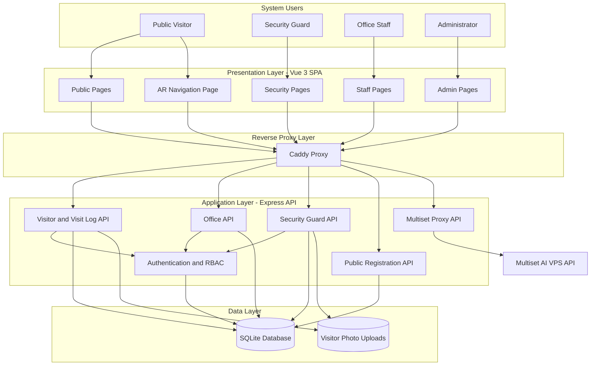
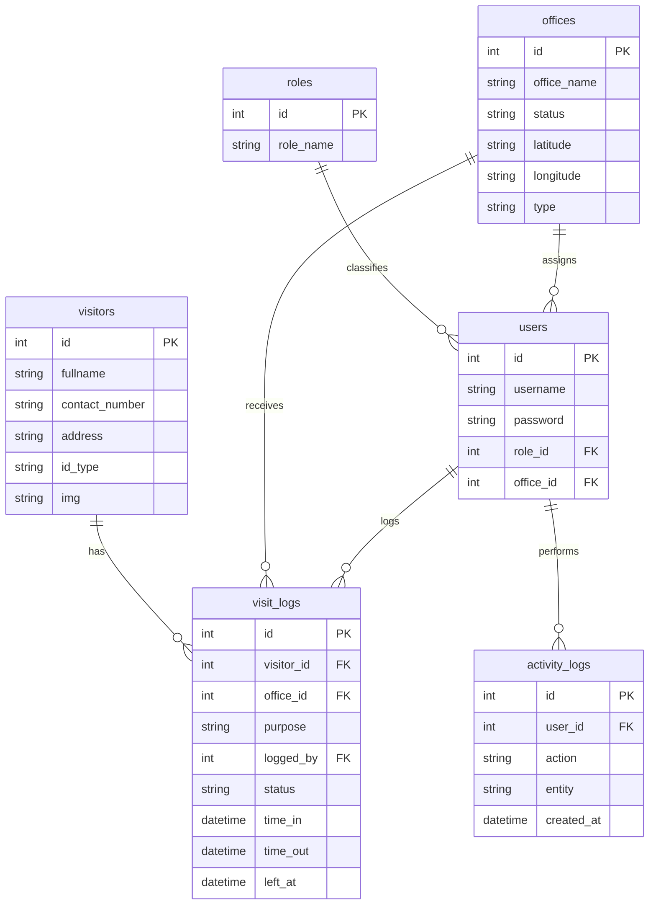
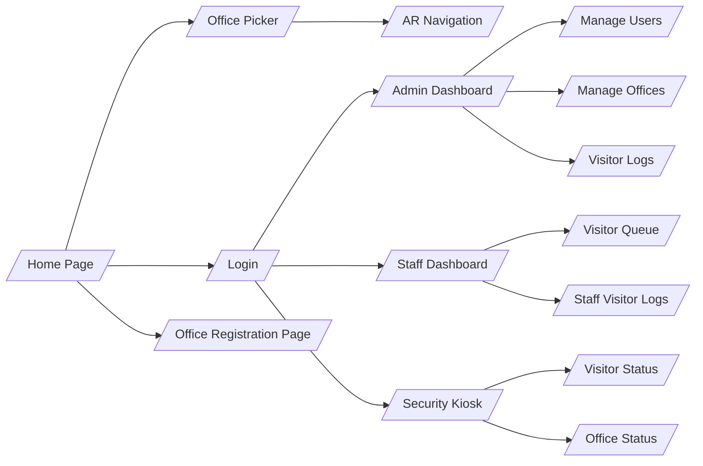
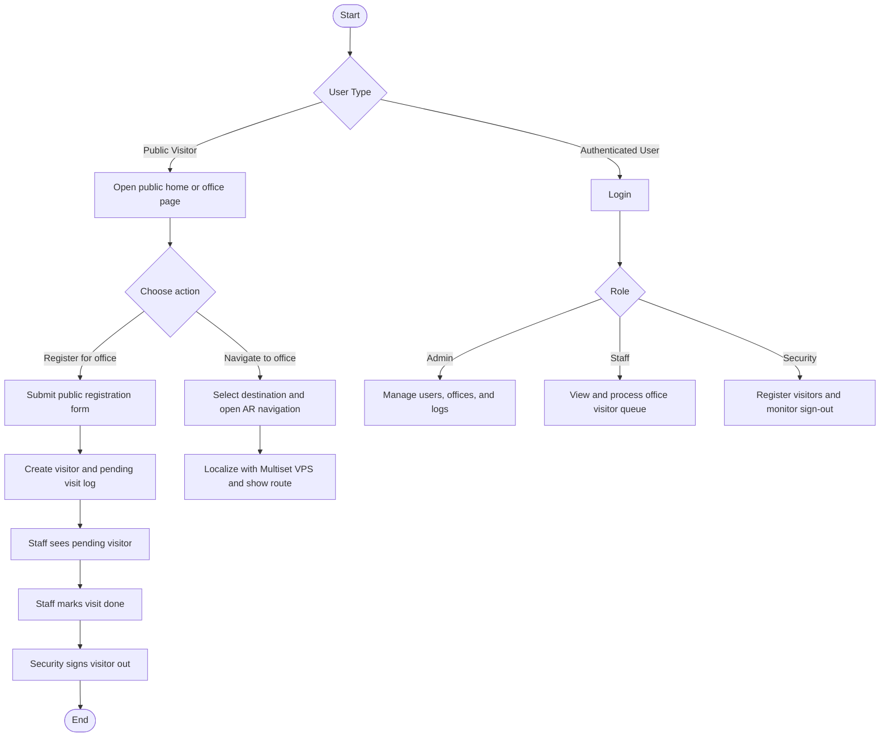
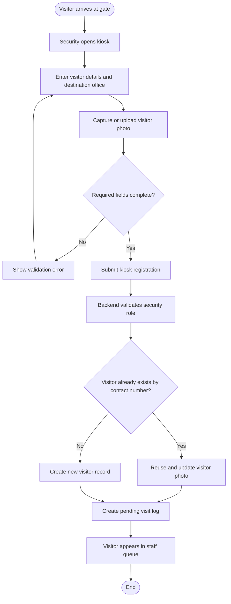
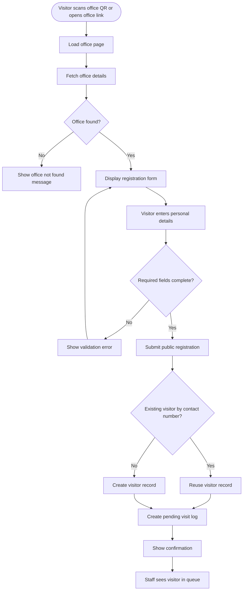
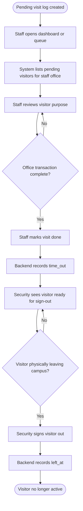
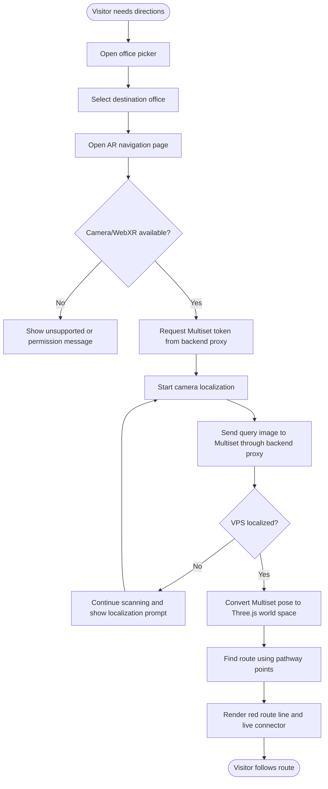
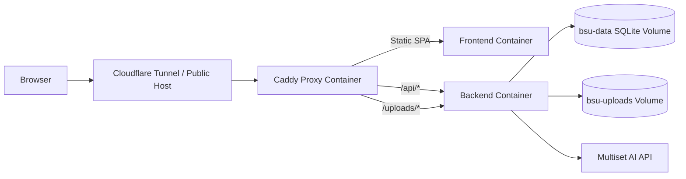

# CHAPTER 4
# SYSTEM DESIGN, DEVELOPMENT, AND IMPLEMENTATION

## 4.1 Introduction

This chapter presents the design and implementation of the **BSU Visitor Management System**, a web-based visitor management platform developed for Batangas State University. The system was designed to replace manual visitor logging with a digital process that supports visitor registration, office assignment, staff queue monitoring, security sign-out, public office self-registration, and AR-assisted campus navigation.

The system follows a three-tier architecture composed of a presentation layer, an application layer, and a data layer. The presentation layer is implemented as a Vue 3 single-page application. The application layer is implemented using Node.js and Express.js. The data layer uses SQLite for storing users, offices, visitors, visit logs, roles, and activity records. The system also includes a public AR navigation feature using Multiset AI VPS and WebXR to help visitors locate destination offices.

The purpose of this chapter is to document the actual system structure, modules, database design, API design, user interface design, system flowcharts, deployment topology, and security mechanisms used in the project.

---

## 4.2 System Overview

The BSU Visitor Management System manages the visitor journey from entry to exit. It supports both authenticated personnel and public visitors.

Authenticated users are grouped into three roles:

| Role | Description | Main Functions |
|---|---|---|
| Admin | System administrator | Manage users, offices, visitor records, and dashboard data |
| Staff | Office personnel | View office visitors, process pending visitors, and mark visits as done |
| Security | Guard or security personnel | Register visitors at the kiosk, monitor active visitors, update office status, and sign visitors out |

Public users can access selected pages without logging in:

| Public Page | Purpose |
|---|---|
| `/` | Public home page and office access entry |
| `/office` | Office picker for public AR navigation |
| `/office/:id` | Public office visitor self-registration page |
| `/navigate` | AR navigation page for guiding visitors to a selected destination |

The system provides two main visitor registration methods:

1. **Security kiosk registration** - A security guard registers a visitor at the entrance with a photo and destination office.
2. **Public office self-registration** - A visitor scans or opens an office-specific link and registers without needing an account.

After a visitor is registered, the assigned office staff can view and process the visit. When the visit is completed, security can sign the visitor out once the visitor physically leaves the campus.

---

## 4.3 Development Tools and Technology Stack

The project uses modern web development technologies for both frontend and backend implementation.

| Layer | Technology Used | Purpose |
|---|---|---|
| Frontend | Vue 3 | Builds the user interface through reusable components |
| Routing | Vue Router | Handles public, admin, staff, and security routes |
| State Management | Pinia | Manages user session and application state |
| Styling | Tailwind CSS v4 | Provides responsive and consistent user interface styling |
| Build Tool | Vite | Builds and serves the frontend application |
| Backend | Node.js with Express 5 | Provides REST API endpoints and business logic |
| Authentication | JSON Web Token (JWT) | Maintains secure user sessions through httpOnly cookies |
| Authorization | Role-based middleware | Restricts routes and actions by user role |
| Database | SQLite with better-sqlite3 | Stores persistent application data |
| File Upload | Multer | Handles visitor photo uploads |
| AR Navigation | Multiset AI VPS, WebXR, Three.js | Provides camera-based indoor navigation support |
| Deployment | Docker Compose | Runs backend, frontend, and proxy services |
| Reverse Proxy | Caddy | Serves frontend, backend API, and uploads through one origin |

---

## 4.4 System Architecture

The system uses a three-tier architecture. This architecture separates the interface, business logic, and data storage, making the system easier to maintain and extend.

### 4.4.1 Architecture Layers

| Layer | Component | Description |
|---|---|---|
| Presentation Layer | Vue 3 frontend | Displays pages, forms, dashboards, tables, and AR navigation views |
| Application Layer | Express backend | Validates requests, enforces authentication and roles, processes visitor workflows |
| Data Layer | SQLite database | Stores users, roles, visitors, offices, visit logs, and activity logs |

### 4.4.2 System Architecture Diagram

### 4.4.3 Architectural Pattern

The backend follows the **Model-View-Controller (MVC)** pattern:

| MVC Part | Project Folder | Responsibility |
|---|---|---|
| Model | `backend/src/models/` | Direct database operations using prepared SQL statements |
| Controller | `backend/src/controllers/` | Handles request logic and response formatting |
| Route | `backend/src/routes/` | Defines API paths and attaches middleware |
| Middleware | `backend/src/middleware/` | Handles authentication, role checks, file upload, and activity logging |

The frontend follows a **component-based architecture** using Vue single-file components. Each page is divided by user role and placed under the appropriate view folder.

---

## 4.5 System Modules

### 4.5.1 Authentication Module

The authentication module allows users to log in, log out, and retrieve their current session. It uses JWT stored in an httpOnly cookie to reduce the risk of exposing the token to frontend scripts.

Main files:

- `backend/src/routes/authRoutes.js`
- `backend/src/controllers/UserController.js`
- `backend/src/middleware/authMiddleware.js`
- `client/src/store/user.js`
- `client/src/views/AuthPages/LoginPage.vue`

Main endpoints:

| Method | Endpoint | Description |
|---|---|---|
| POST | `/api/users/login` | Authenticates user and issues session cookie |
| POST | `/api/users/logout` | Clears session cookie |
| GET | `/api/users/me` | Returns current logged-in user |

### 4.5.2 User and Role Management Module

This module allows administrators to manage system users and roles. It supports creating admin, staff, and security accounts. Staff accounts may be assigned to a specific office.

Main role restrictions:

- Only admin users can create, update, view, and delete user accounts.
- Any authenticated user can retrieve their own session data.

### 4.5.3 Office Management Module

This module manages campus offices used as visitor destinations. Admin users can manage office records, while security users can update office status when needed.

Main files:

- `backend/src/routes/officeRoutes.js`
- `backend/src/models/Office.js`
- `client/src/views/AdminPages/Offices.vue`
- `client/src/views/GuardPages/OfficeStatus.vue`

### 4.5.4 Visitor Management Module

This module stores visitor profiles. Visitor details may come from the security kiosk flow or the public office self-registration flow.

Visitor information includes:

- Full name
- Contact number
- Address
- ID type
- Visitor photo path, if captured through the kiosk

Main files:

- `backend/src/routes/visitorRoutes.js`
- `backend/src/models/Visitor.js`
- `backend/src/controllers/VisitorController.js`

### 4.5.5 Visit Log Module

The visit log module records every visit transaction. It stores the visitor, destination office, visit purpose, time-in, time-out, sign-out time, and current status.

Main files:

- `backend/src/routes/visitorLogRoutes.js`
- `backend/src/models/VisitLog.js`
- `backend/src/controllers/VisitorLogController.js`

The visit log connects the visitor record to the office they are visiting.

### 4.5.6 Security Kiosk Module

The security kiosk module is used by guards to register walk-in visitors at the campus entrance. This flow requires a visitor photo.

Main endpoint:

| Method | Endpoint | Role | Description |
|---|---|---|---|
| POST | `/api/security-guard/kiosk/register` | security | Registers visitor and creates a pending visit log |

Required fields:

- `fullname`
- `contact_number`
- `address`
- `office_id`
- `img` visitor photo

### 4.5.7 Staff Queue Module

The staff queue module allows office staff to see visitors assigned to their office. Staff can process visitors and mark the visit as done after completing the visitor's purpose.

Main endpoints:

| Method | Endpoint | Role | Description |
|---|---|---|---|
| GET | `/api/visit-logs/pending` | authenticated staff/admin context | Lists pending visitors |
| PATCH | `/api/visit-logs/:id/done` | staff/admin | Marks visit as done |

### 4.5.8 Security Sign-Out Module

After staff marks a visit as done, security personnel can sign the visitor out when the visitor physically leaves the campus.

Main endpoints:

| Method | Endpoint | Role | Description |
|---|---|---|---|
| GET | `/api/security-guard/visitors/active` | security | Lists visitors still inside campus |
| PATCH | `/api/security-guard/visit-logs/:id/sign-out` | security | Records visitor's physical exit time |

### 4.5.9 Public Office Registration Module

This module allows visitors to register for a specific office without logging in. It is intended for fixed office QR links.

Main endpoints:

| Method | Endpoint | Access | Description |
|---|---|---|---|
| GET | `/api/public/offices` | public | Lists public offices |
| GET | `/api/public/office/:id` | public | Gets selected office details |
| POST | `/api/public/office/:id/register` | public | Registers a visitor for the selected office |

Unlike the security kiosk flow, public registration does not require a visitor photo.

### 4.5.10 AR Navigation Module

The AR navigation module helps public visitors navigate to selected offices. It uses a public office picker, WebXR camera flow, Multiset VPS localization, and Three.js route rendering.

Main files:

- `client/src/views/PublicPages/OfficeNavPicker.vue`
- `client/src/views/PublicPages/NavAr.vue`
- `client/src/config/arNavigation.js`
- `backend/src/routes/multisetRoutes.js`

Main AR process:

1. Visitor opens `/office`.
2. Visitor selects a destination.
3. System opens `/navigate` with destination details.
4. Browser opens camera/WebXR view.
5. Backend proxy requests Multiset token using server-side credentials.
6. Frontend sends camera query image to the backend proxy.
7. Multiset returns localization data.
8. Frontend renders a route line using real map-space pathway points.

---

## 4.6 Database Design

The system uses SQLite as the database engine. SQLite was selected because the system is lightweight, easy to deploy, and suitable for a campus visitor management prototype.

### 4.6.1 Database Tables

| Table | Description |
|---|---|
| `roles` | Stores user roles such as admin, staff, and security |
| `users` | Stores system user accounts and assigned roles |
| `offices` | Stores office destinations and availability status |
| `visitors` | Stores visitor profile information |
| `visit_logs` | Stores each visitor transaction and visit status |
| `activity_logs` | Stores activity history for audit purposes |

### 4.6.2 Entity Relationship Diagram

### 4.6.3 Table Descriptions

#### roles

The `roles` table defines the different access levels in the system.

| Field | Description |
|---|---|
| `id` | Unique role identifier |
| `role_name` | Name of the role: admin, staff, or security |

#### users

The `users` table stores system accounts.

| Field | Description |
|---|---|
| `id` | Unique user identifier |
| `username` | Login username |
| `password` | Hashed password |
| `role_id` | Connected role |
| `office_id` | Assigned office for staff accounts |

#### offices

The `offices` table stores destination offices in the campus.

| Field | Description |
|---|---|
| `id` | Unique office identifier |
| `office_name` | Office name |
| `status` | Office availability status |
| `latitude` / `longitude` | Stored location fields from original office data |
| `type` | Office category |

#### visitors

The `visitors` table stores visitor information.

| Field | Description |
|---|---|
| `id` | Unique visitor identifier |
| `fullname` | Visitor full name |
| `contact_number` | Visitor contact number |
| `address` | Visitor address |
| `id_type` | Identification type |
| `img` | Uploaded visitor photo path, if available |

#### visit_logs

The `visit_logs` table stores the actual visit transaction.

| Field | Description |
|---|---|
| `id` | Unique visit log identifier |
| `visitor_id` | Linked visitor |
| `office_id` | Destination office |
| `purpose` | Visit purpose |
| `logged_by` | User who registered the visitor |
| `status` | Current visit status |
| `time_in` | Time visitor entered or registered |
| `time_out` | Time staff marked visit as done |
| `left_at` | Time security confirmed visitor left campus |

---

## 4.7 API Design

The backend provides REST API endpoints under the `/api` prefix. The frontend communicates with these endpoints through same-origin requests routed by the Caddy proxy.

### 4.7.1 API Endpoint Summary

| Module | Endpoint | Access |
|---|---|---|
| Health | `GET /api/health` | public/system |
| Authentication | `/api/users/login`, `/api/users/logout`, `/api/users/me` | public/authenticated |
| Users | `/api/users` | admin |
| Visitors | `/api/visitors` | authenticated |
| Visit Logs | `/api/visit-logs` | authenticated |
| Offices | `/api/offices` | authenticated |
| Visitor Status | `/api/visitor-status` | authenticated |
| Security Guard | `/api/security-guard` | security |
| Public Registration | `/api/public` | public |
| Public Home | `/api/public-home` | public |
| Multiset Proxy | `/api/multiset` | public same-origin proxy |
| Roles | `/api/roles` | authenticated |

### 4.7.2 Authentication and Authorization

The system uses JWT authentication. When a user logs in, the backend creates a token and stores it in an httpOnly cookie. The cookie is automatically sent with future requests. The backend checks the token using `authMiddleware`.

After authentication, the system checks the user's role using `roleMiddleware`. This ensures that only authorized users can access restricted routes.

Examples:

| Action | Required Role |
|---|---|
| Manage users | Admin |
| Register visitor at kiosk | Security |
| Sign visitor out | Security |
| Mark visit done | Staff or Admin |
| View public office page | No login required |
| Use public AR navigation | No login required |

### 4.7.3 Error Handling

The backend returns JSON responses for errors. Common errors include:

| Status Code | Meaning |
|---|---|
| 400 | Invalid or missing input |
| 401 | User is not authenticated |
| 403 | User is authenticated but does not have the required role |
| 404 | Requested record was not found |
| 500 | Unexpected server error |

---

## 4.8 User Interface Design

The frontend is divided by role and page purpose. Authenticated pages use a shared layout, while public visitor pages use a simpler layout suitable for visitors.

### 4.8.1 Navigation Structure

### 4.8.2 Interface Pages

| Page | Users | Description |
|---|---|---|
| Login Page | Admin, staff, security | Allows authenticated users to access the system |
| Home Page | Public and authenticated users | Shows entry points and public office access |
| Admin Dashboard | Admin | Shows system overview and management shortcuts |
| User List | Admin | Displays and manages users |
| Offices Page | Admin | Displays and manages offices |
| Staff Dashboard | Staff | Shows pending visitors assigned to the office |
| Visitor Queue | Staff | Displays visitors waiting for office service |
| Security Kiosk | Security | Registers walk-in visitors with photo |
| Visitor Status | Security | Shows active visitors and sign-out actions |
| Office Status | Security | Updates office availability |
| Office Visitor Access | Public visitors | Allows self-registration for a selected office |
| Office Navigation Picker | Public visitors | Allows destination selection for AR navigation |
| AR Navigation | Public visitors | Displays AR route guidance using camera and VPS localization |

---

## 4.9 System Flowcharts

### 4.9.1 Overall System Flow

### 4.9.2 Guard Kiosk Registration Flow

### 4.9.3 Public Office Self-Registration Flow

### 4.9.4 Staff Processing and Security Sign-Out Flow

### 4.9.5 AR Navigation Flow

### 4.9.6 Deployment Flow

---

## 4.10 Security Design

The system includes several security controls to protect user accounts, visitor records, and system routes.

| Security Concern | Implementation |
|---|---|
| Password protection | Passwords are hashed before being stored |
| Session handling | JWT stored in httpOnly cookies |
| Route protection | `authMiddleware` blocks unauthenticated access |
| Role restriction | `roleMiddleware` blocks unauthorized roles |
| File upload safety | Multer accepts visitor photo uploads and rejects invalid inputs |
| Secret protection | Multiset credentials stay on the backend environment |
| SQL injection prevention | Database queries use prepared statements |
| CORS and mixed-content prevention | Caddy proxy exposes frontend and API through one origin |
| Visitor photo privacy | Uploaded photos are stored in server-side upload storage |

---

## 4.11 Deployment Design

The system is deployed using Docker Compose with three main services.

| Container | Description |
|---|---|
| `bsu-visitor-backend` | Runs the Express API and connects to SQLite |
| `bsu-visitor-frontend` | Serves the built Vue application |
| `bsu-visitor-proxy` | Uses Caddy to route frontend, API, and upload requests |

The deployment uses two named volumes:

| Volume | Purpose |
|---|---|
| `bsu-data` | Stores the SQLite database |
| `bsu-uploads` | Stores visitor photos |

The browser accesses the system through a single public origin. API calls are routed through `/api/*`, uploaded photos through `/uploads/*`, and all frontend routes are served by the Vue single-page application.

---

## 4.12 Summary

This chapter documented the design and implementation of the BSU Visitor Management System. The system was designed as a three-tier web application with a Vue 3 frontend, Express backend, SQLite database, and Docker-based deployment. It supports admin, staff, security, and public visitor workflows.

The system replaces manual visitor logging with digital records, supports visitor queue monitoring, records entry and exit timestamps, and provides public self-registration for offices. It also includes AR-assisted navigation using Multiset VPS, WebXR, and Three.js to guide visitors to selected campus destinations.

Through authentication, role-based access control, prepared database statements, server-side credential handling, and same-origin proxy deployment, the system provides a secure and maintainable foundation for campus visitor management.
